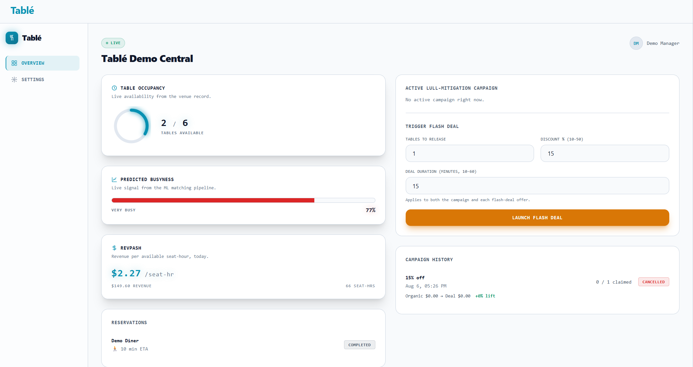
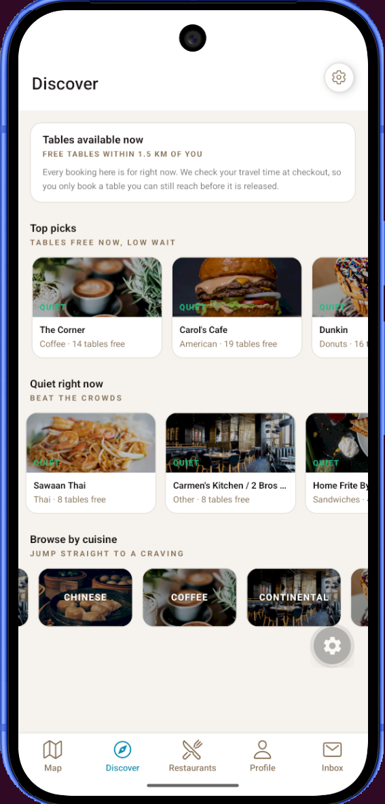
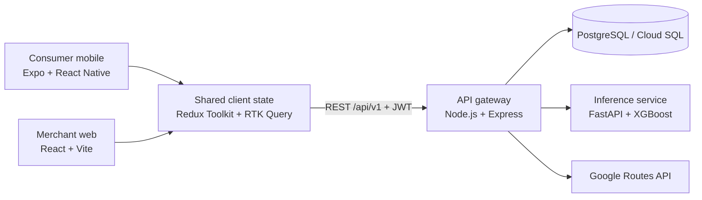

<div align="center">

# Tablé

**Tables available now, reachable in time.**

A two-sided immediate-dining MVP for spontaneous diners and restaurant operators.


*UCD COMP47360 Research Practicum — Team 2, 2026*

</div>

---
<div align="center">

| Restaurant view — manager dashboard (web) | Consumer view — discovery (mobile) |
| :---: | :---: |
|  |  |

</div>

## Introduction

Tablé connects two problems that happen at the same time:

- diners can travel to a restaurant and discover that no table is available; and
- restaurants lose revenue when tables remain empty during quiet periods.

The consumer app shows nearby restaurants with bookable capacity, calculates an ETA, and only confirms an immediate booking when the diner can arrive within the restaurant's hold window. The merchant dashboard lets restaurant operators monitor availability, bookings, busyness and demonstration RevPASH metrics, then release a limited number of private, time-boxed flash deals.

The product is designed as a closed loop:

```text
restaurant releases capacity
        ↓
nearby diners receive private offers
        ↓
diner books or accepts an offer
        ↓
inventory, campaign and booking state update on both clients
```

## Monorepo Structure

- JWT registration and sign-in, plus guest discovery
- preference onboarding for cuisine, budget, dining style and access needs
- map, discovery and restaurant-card views within a default 1.5 km radius
- search, filtering, sorting, ratings and current table availability
- walking, driving, cycling and transit ETA checks
- immediate booking with server-side hold-window validation
- booking history, cancellation and directions in an external maps app
- private flash-deal inbox with countdown, claim and expiry states
- light/dark themes and accessibility preferences

## How the core flow works

1. The mobile client requests restaurants with available tables near the diner's location.
2. The API gateway calculates route ETA with Google Routes and falls back to a local distance estimate if the external API is unavailable.
3. The gateway compares ETA with the restaurant's hold window before creating a booking.
4. A restaurant manager can launch a campaign for a limited table quota.
5. Nearby diner candidates are ranked by the matching service; the gateway falls back to distance ordering if the ML service is unavailable.
6. Each selected diner receives a private offer. Accepting it creates a confirmed booking and updates campaign and inventory state.
7. A campaign ends when its quota is filled, its TTL expires, or the manager cancels it.

## Architecture



The Express gateway is the single transactional API for both clients. It owns authentication, validation, bookings, offers, campaigns and restaurant operations. PostgreSQL enforces core constraints and maintains the shared state. The FastAPI service provides:

- an XGBoost busyness prediction using restaurant features and historical NYC taxi demand, with optional booking-history maturation; and
- deterministic flash-deal candidate ranking using distance, cuisine and access preferences.

## Technology stack

| Area | Implementation |
| --- | --- |
| Merchant client | React 19, Vite, React Router, Tailwind CSS |
| Consumer client | Expo 56, React Native, Expo Router, NativeWind |
| Shared client layer | Redux Toolkit, RTK Query, TypeScript |
| API | Node.js, Express 5, JWT, Jest, Supertest |
| Data | PostgreSQL, SQL migrations, optional PostGIS |
| ML | Python, FastAPI, XGBoost/scikit-learn pipeline, pandas |
| External routing | Google Routes API with haversine fallback |
| Web hosting | Firebase Hosting |
| Services | Google Cloud Run, Cloud SQL, Secret Manager |
| CI | GitHub Actions, OpenAPI lint/drift checks, Jest, Vitest, pytest |

## Repository layout

```text
comp47360-team2/
├── docker-compose.yml   # Full local stack (see docs/ops/docker-local.md)
├── docs/                # All documentation, grouped by audience (see docs/README.md)
│   ├── product/           # Product spec, user stories
│   ├── architecture/      # ADR, API contract + OpenAPI, data strategy, DB schema
│   ├── ops/               # Running, deploying, rolling back, load testing
│   ├── design/            # UI style guide
│   ├── user-testing/      # Usability + SUS reports, and the fixes they drove
│   ├── sprints/           # Retrospectives and Jira links
│   ├── budget-timesheets/ # Timesheet and budget tracker
│   └── academic/          # Business plan, IEEE paper
├── frontend/            # Frontend ecosystem
│   ├── web-app/           # Responsive Web App (React + Vite)
│   ├── mobile-app/        # Cross-platform Mobile App (React Native/Expo)
│   └── packages/shared/   # Shared API client + types (RTK Query)
├── backend/             # Backend
│   └── api-gateway/       # API Gateway & business logic (Node.js/Express monolith)
├── ml-pipeline/         # Machine Learning & Data Engine
│   ├── fastapi-app/       # Algorithm Inference API (Python/FastAPI)
│   └── notebooks/         # Data exploration & feature engineering workflows
└── database/            # PostgreSQL migrations and seeds
```

## Key Documents

Nested top-down: each document assumes the one above it, so read a branch in order.
The full index, grouped by audience, is [`docs/README.md`](./docs/README.md).

**Product — what we're building**

- [Product spec](./docs/product/product-spec.md) — the MVP in one page
  - [User stories](./docs/product/user-stories/) — acceptance criteria per journey
  - [User testing](./docs/user-testing/) — usability test & interview report, SUS scores, and the [fixes change log](./docs/user-testing/user-testing-fixes-strategy.md) tracking what each finding changed in the code

**Architecture — start here for engineering**

- [ADR-001](./docs/architecture/adr/ADR-001.md) — the binding architecture decisions (A–J); everything below implements one of them
  - [Data strategy](./docs/architecture/data-strategy.md) — datasets, busyness representation, simulated live updates
    - [Database schema](./docs/architecture/database-schema.md) — tables, migrations, seeds
  - [API contract v0](./docs/architecture/api-contract-v0.md) — routes, payloads, errors ([openapi-v0.yaml](./docs/architecture/openapi-v0.yaml) · [Postman collection](./docs/architecture/postman/))
    - [Integration strategy](./docs/architecture/integration-strategy.md) — how the four workspaces stay contract-compatible
  - [Frontend strategy](./docs/architecture/frontend-strategy.md) — page flow, stack, auth and sync
    - [UI style guide](./docs/design/ui-style-guide.md) — one visual language across web and mobile
  - [System architecture map](./docs/architecture/system-architecture-map.md) — file-level map of the running system

**Operations — running and shipping it**

- [Docker local](./docs/ops/docker-local.md) — the full stack locally; the supported way to run Tablé today
- [Deployment guide](./docs/ops/deployment-guide.md) — branch flow (`feature/* → integrate → develop → main`) and CI/CD
  - [Cloud deployments](./cloud_deployments/README.md) — Terraform per provider (none currently live)
  - [Rollback & recovery runbook](./docs/ops/rollback-recovery-runbook.md) — what to do after a bad deploy
- [Performance testing](./docs/ops/performance-testing.md) — load/latency SLOs and results

**Project record** — [Risk register](./RISK_REGISTER.md) · [Sprint retrospectives](./docs/sprints/) · [Timesheet & budget tracker](./docs/budget-timesheets/) · [Business plan](./docs/academic/business-plan/Team%202%20Business%20Plan_v4.docx) · [IEEE paper](./docs/academic/final-paper/table-ieee-paper-updated.tex)

- Node.js 20 and npm
- Docker Desktop or PostgreSQL 14+
- Python 3.11+
- Expo tooling for native mobile development

## Team Roles

| Name | Role | Responsibilities |
| :--- | :--- | :--- |
| **Yuhao Xu** | Product & UX Lead | Owns product logic and specs (`docs/product/product-spec.md`), UX design walkthroughs, and business value alignment; drives QA and product research — integration tests, API contract validation, accessibility testing, internal & external usability rounds, user interviews, feedback synthesis (`docs/user-testing/`), and the final paper outline. |
| **Chukwuemeka Nwoke** | Integration Lead / Scrum Master | Runs sprint ceremonies and retrospectives (`docs/sprints/`); owns the CI/CD pipeline — `ci.yml`, `deploy-staging.yml`, branch protection rules — and the `feature/* → integrate → develop → main` branch flow; maintains `RISK_REGISTER.md` and GitHub compliance reviews. |
| **Andrew Mitchell** | Web Frontend Lead | Leads `frontend/web-app` architecture and responsive UI implementation — form validation, accessibility audits, the shared component library, merchant sign-up flow, JWT auth wiring, and usability/accessibility fixes. |
| **Milo Dennehy** | Mobile App Lead | Leads `frontend/mobile-app` cross-platform development — map/discovery components, push notifications, Redux state management, bookings & settings UI, mobile JWT auth, and mobile accessibility fixes. |
| **Yang Liu** | Backend Lead | Leads `backend/api-gateway` and the database schema — auth, bookings, restaurants, offers, campaigns, and ETA endpoints; booking-lifecycle hardening, rate-limiter fixes, and the database backup & recovery plan. |
| **Rui Xu** *(Jack)* | Data & ML Lead | Leads `ml-pipeline/` — busyness prediction model, user-restaurant matching algorithm, and the FastAPI inference endpoint; model evaluation/tuning, RevPASH-informed retraining, drift monitoring, and the ML section of the final paper. |

---

## Getting Started

The whole platform runs in Docker. Docker is the only prerequisite — no Node,
Python, PostgreSQL, or Expo install needed.

```bash
git clone https://github.com/chukwuemekanwoke-jpg/comp47360-team2.git
cd comp47360-team2

cp .env.example .env          # defaults work as-is; Google Maps keys are optional
npm run docker:up  # first run ~5 min, mostly the ML image
```

| Service | Where | Notes |
| :--- | :--- | :--- |
| Web app | <http://localhost:5173> | Log in as `manager@demo.com` / `password123` |
| API gateway | <http://localhost:3001> | `/health`, `/api/v1/...` |
| ML service | <http://localhost:8000> | `/health`, `/docs` |
| Postgres | `localhost:5432` | Schema and demo data seeded automatically |

Add the mobile app when you need it. The Expo dev server runs in a container
too, and serves the app both to a browser and to a phone over an ngrok tunnel:

**Note: for demo purposes the JWT authentication token system is disabled,
when you open a tunnel that is an attack surface, even though the application runs
in a container we recommend closing this container when you are done testing!**
This only applies to the mobile app, as it has to expose some external entrypoint for
phone connection.
```bash
npm run docker:mobile
```

| Target | Where | Notes |
| :--- | :--- | :--- |
| Mobile app (browser) | <http://localhost:8081> | Expo web — click through the app with no phone or emulator |
| Mobile app (phone) | The tunnel URL printed above | Open it in Expo Go or a dev build |

`docker:mobile` waits for the ngrok tunnel and prints its URL, so starting the
server also tells you how to reach it (`npm run docker:mobile:url` reprints it).
The QR code in the logs points at the same tunnel, but it is drawn with block
characters that `docker compose logs` mangles — the printed URL is the reliable
way in.

### Common commands

```bash
npm run docker:down     # stop everything
```

| Command | Does |
| :--- | :--- |
| `npm run docker:up` | Start (or rebuild) the stack |
| `npm run docker:down` | **Stop everything, keeping the database** |
| `npm run docker:mobile` | Start the Expo dev server and print its tunnel URL |
| `npm run docker:mobile:url` | Reprint the tunnel URL for a phone |
| `npm run docker:mobile:logs` | Follow Expo logs / show the QR code |
| `npm run docker:logs` | Follow all logs |
| `npm run docker:ps` | Show what's running |
| `npm run docker:reset` | Wipe the database and start fresh |

> Use `npm run docker:down` rather than a bare `docker compose down` — the
> latter skips the mobile container and fails with
> `Network table_table-network Resource is still in use`.

**Full guide — API keys, seeding, hot-reload workflows, troubleshooting:
[`docs/ops/docker-local.md`](./docs/ops/docker-local.md)**

> *To run a sub-module natively instead (nodemon, Vite HMR, Expo CLI on the host),
> see the `README.md` in its directory, or the hybrid workflow section of the
> Docker guide.*

### Cloud Deployment Status

Nothing in `cloud_deployments/` currently points at a live cloud environment — the app runs locally via Docker as shown above. The GCP staging/prod projects were decommissioned (deleted, billing closed) on **2026-08-01**; the `gcp/` Terraform is kept as a historical record only. The `aws/` and `azure/` configs are greenfield designs, never applied. See [`cloud_deployments/README.md`](cloud_deployments/README.md) for the full picture, including how to build and run the `api-gateway` and `ml-service` containers directly with Docker.


## Deployment and branch flow

Code moves through:

```text
feature/* → integrate → develop → main
```

- `integrate` is the current integration source of truth and the branch used to verify this README.
- `develop` is the staging promotion branch.
- `main` is the protected release branch.

The staging architecture uses Firebase Hosting for the merchant web build, Cloud Run for the API and ML services, Cloud SQL for PostgreSQL, and Secret Manager for runtime secrets. 

## MVP limitations and next steps

Tablé is an academic MVP, not a production marketplace. The next validation steps would be real restaurant-manager research, live inventory/POS integration, a larger and more varied usability study, production-grade notifications, measured offer conversion and a validated revenue model.

## License

This repository is licensed under the [MIT License](LICENSE).
