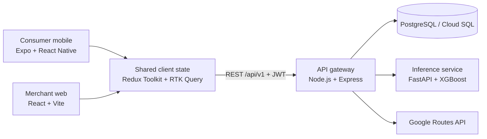

<div align="center">

# 🍽️ Tablé

**Tables available now, reachable in time.**

A two-sided immediate-dining MVP for spontaneous diners and restaurant operators.


*UCD COMP47360 Research Practicum — Team 2, 2026*

</div>

---

## Overview

Tablé connects two problems that happen at the same time:

- diners can travel to a restaurant and discover that no table is available; and
- restaurants lose revenue when tables remain empty during quiet periods.

The consumer app shows nearby restaurants with bookable capacity, calculates an ETA, and only confirms an immediate booking when the diner can arrive within the restaurant's hold window. The merchant dashboard lets restaurant operators monitor availability, bookings, busyness and demonstration RevPASH metrics, then release a limited number of private, time-boxed flash deals.

The product is designed as a closed loop:

```text
restaurant releases capacity
        ↓
nearby diners receive private offers
        ↓
diner books or accepts an offer
        ↓
inventory, campaign and booking state update on both clients
```

## Product surfaces

### Consumer mobile app — Expo / React Native

- JWT registration and sign-in, plus guest discovery
- preference onboarding for cuisine, budget, dining style and access needs
- map, discovery and restaurant-card views within a default 1.5 km radius
- search, filtering, sorting, ratings and current table availability
- walking, driving, cycling and transit ETA checks
- immediate booking with server-side hold-window validation
- booking history, cancellation and directions in an external maps app
- private flash-deal inbox with countdown, claim and expiry states
- light/dark themes and accessibility preferences

### Merchant web dashboard — React / Vite

- manager registration, restaurant setup and JWT sign-in
- occupancy, predicted busyness and demonstration RevPASH views
- live booking list and booking-status management
- flash-deal creation with table quota, 10–50% discount and 10–60 minute TTL
- active-campaign status, live offer tracker, campaign history and cancellation
- restaurant details, accessibility settings and light/dark themes

## How the core flow works

1. The mobile client requests restaurants with available tables near the diner's location.
2. The API gateway calculates route ETA with Google Routes and falls back to a local distance estimate if the external API is unavailable.
3. The gateway compares ETA with the restaurant's hold window before creating a booking.
4. A restaurant manager can launch a campaign for a limited table quota.
5. Nearby diner candidates are ranked by the matching service; the gateway falls back to distance ordering if the ML service is unavailable.
6. Each selected diner receives a private offer. Accepting it creates a confirmed booking and updates campaign and inventory state.
7. A campaign ends when its quota is filled, its TTL expires, or the manager cancels it.

## Architecture



The Express gateway is the single transactional API for both clients. It owns authentication, validation, bookings, offers, campaigns and restaurant operations. PostgreSQL enforces core constraints and maintains the shared state. The FastAPI service provides:

- an XGBoost busyness prediction using restaurant features and historical NYC taxi demand, with optional booking-history maturation; and
- deterministic flash-deal candidate ranking using distance, cuisine and access preferences.

## Technology stack

| Area | Implementation |
| --- | --- |
| Merchant client | React 19, Vite, React Router, Tailwind CSS |
| Consumer client | Expo 56, React Native, Expo Router, NativeWind |
| Shared client layer | Redux Toolkit, RTK Query, TypeScript |
| API | Node.js, Express 5, JWT, Jest, Supertest |
| Data | PostgreSQL, SQL migrations, optional PostGIS |
| ML | Python, FastAPI, XGBoost/scikit-learn pipeline, pandas |
| External routing | Google Routes API with haversine fallback |
| Web hosting | Firebase Hosting |
| Services | Google Cloud Run, Cloud SQL, Secret Manager |
| CI | GitHub Actions, OpenAPI lint/drift checks, Jest, Vitest, pytest |

## Repository layout

```text
comp47360-team2/
├── frontend/
│   ├── web-app/              # B-side merchant dashboard
│   ├── mobile-app/           # C-side Expo application
│   └── packages/shared/      # shared Redux store, API client and types
├── backend/
│   └── api-gateway/          # Express REST API and business rules
├── ml-pipeline/
│   ├── fastapi-app/          # prediction and matching inference service
│   └── notebooks/            # research, data engineering and training work
├── database/
│   ├── migrations/           # versioned PostgreSQL schema
│   ├── seeds/                # deterministic demo and Manhattan datasets
│   └── scripts/              # migration, seed and enrichment tools
├── docs/                     # product, architecture, API and testing docs
├── cloud_deployments/        # GCP state model plus AWS/Azure design exercises
└── .github/workflows/        # CI and staging deployment workflows
```

## Local setup

### Prerequisites

- Node.js 20 and npm
- Docker Desktop or PostgreSQL 14+
- Python 3.11+
- Expo tooling for native mobile development

Google Maps keys are optional for local development. Without the server-side Routes key, ETA uses the local fallback. Without the browser Maps key, merchant location setup falls back to manual coordinates.

### 1. Install JavaScript dependencies

```bash
git clone https://github.com/chukwuemekanwoke-jpg/comp47360-team2.git
cd comp47360-team2
npm install
```

### 2. Start and seed PostgreSQL

```bash
cp database/.env.example database/.env
npm run db:up
npm run migrate
npm run seed
```

The default seed supplies stable users, restaurants and RevPASH demo bookings. For the larger Manhattan restaurant set or historical taxi-demand features, see [`database/seeds/README.md`](database/seeds/README.md).

### 3. Configure and run the API gateway

```bash
cp backend/api-gateway/.env.example backend/api-gateway/.env
npm run dev:backend
```

Default endpoints:

- API health: `http://localhost:3001/health`
- API status: `http://localhost:3001/api/v1/status`
- OpenAPI contract: [`docs/openapi-v0.yaml`](docs/openapi-v0.yaml)

For deployed environments, replace the development `JWT_SECRET`, disable the legacy `X-User-Id` header, and provide secrets through the platform secret store.

### 4. Run the ML service

```bash
cd ml-pipeline/fastapi-app
python3 -m venv .venv
source .venv/bin/activate
pip install -r requirements.txt
uvicorn main:app --reload --port 8000
```

Swagger UI is available at `http://localhost:8000/docs`.

### 5. Run the merchant web app

From the repository root:

```bash
npm run dev:web
```

Vite serves the dashboard at `http://localhost:5173` and proxies local `/api` requests to the gateway on port 3001. A deployed build can set `VITE_API_URL` to the versioned API base URL.

### 6. Run the consumer mobile app

Set `EXPO_PUBLIC_API_URL` in a gitignored `frontend/mobile-app/.env.local`. Android emulators normally use `http://10.0.2.2:3001/api/v1`; physical devices need the development machine's reachable LAN address.

```bash
npm run dev:mobile
```

Or run Expo directly:

```bash
cd frontend/mobile-app
npm start
```

## Validation

Run the same checks used by CI:

```bash
# API contract and backend tests
npm run check:openapi-drift --workspace=backend/api-gateway
npm run test:coverage --workspace=backend/api-gateway

# Merchant web
npm run lint --workspace=frontend/web-app
npm run test:coverage --workspace=frontend/web-app
npm run build --workspace=frontend/web-app

# Consumer mobile
npm run lint --workspace=frontend/mobile-app

# ML service
cd ml-pipeline/fastapi-app
python -m pytest -q
```

The automated suite includes unit tests, API journey tests, strict OpenAPI response validation and CI coverage thresholds. Manual Postman journeys cover the main diner and merchant flows.

## Data and model scope

- Real restaurant identity data comes from a cleaned Manhattan venue dataset.
- Historical demand features use NYC TLC taxi drop-offs and NYC DOT pedestrian counts.
- Capacity, table availability, accessibility and revenue fields in demo seeds are simulated unless a source is explicitly documented.
- The platform maintains booking availability in its own database; it is not connected to a live POS or third-party reservation provider.
- RevPASH screens demonstrate the calculation using seeded/simulated booking values; they do not prove real restaurant profit lift.

## Deployment and branch flow

Code moves through:

```text
feature/* → integrate → develop → main
```

- `integrate` is the current integration source of truth and the branch used to verify this README.
- `develop` is the staging promotion branch.
- `main` is the protected release branch.

The staging architecture uses Firebase Hosting for the merchant web build, Cloud Run for the API and ML services, Cloud SQL for PostgreSQL, and Secret Manager for runtime secrets. There is no automated production deployment. The AWS and Azure Terraform directories are design exercises and have not been applied to real accounts.

Staging web build: [tabl-app-staging.web.app](https://tabl-app-staging.web.app). Backend services are part of the student staging environment and may be paused or retired after assessment.

See [`docs/deployment-guide.md`](docs/deployment-guide.md) for the delivery process. The latest full product code is available on the [`integrate` branch](https://github.com/chukwuemekanwoke-jpg/comp47360-team2/tree/integrate); promotion to `main` is tracked in [PR #91](https://github.com/chukwuemekanwoke-jpg/comp47360-team2/pull/91).

## Documentation

- [Product specification](docs/product-spec.md)
- [Human-readable API contract](docs/api-contract-v0.md)
- [OpenAPI specification](docs/openapi-v0.yaml)
- [Integration strategy](docs/integration-strategy.md)
- [Deployment guide](docs/deployment-guide.md)
- [UI style guide](docs/ui-style-guide.md)
- [Backend guide](backend/api-gateway/README.md)
- [Database guide](database/README.md)
- [Mobile guide](frontend/mobile-app/README.md)

Additional architecture, performance, infrastructure and risk documents are maintained on the final `integrate` branch.

## Team

| Member | Project role |
| --- | --- |
| Yuhao Xu | Product & UX Lead |
| Chukwuemeka Nwoke | Scrum Master / integration and delivery |
| Andrew Mitchell | Web Frontend Lead |
| Milo Dennehy | Mobile App Lead |
| Yang Liu | Backend Lead |
| Rui Xu | Data & ML Lead |

## MVP limitations and next steps

Tablé is an academic MVP, not a production marketplace. The next validation steps would be real restaurant-manager research, live inventory/POS integration, a larger and more varied usability study, production-grade notifications, measured offer conversion and a validated revenue model.

## License

This repository is licensed under the [MIT License](LICENSE).
