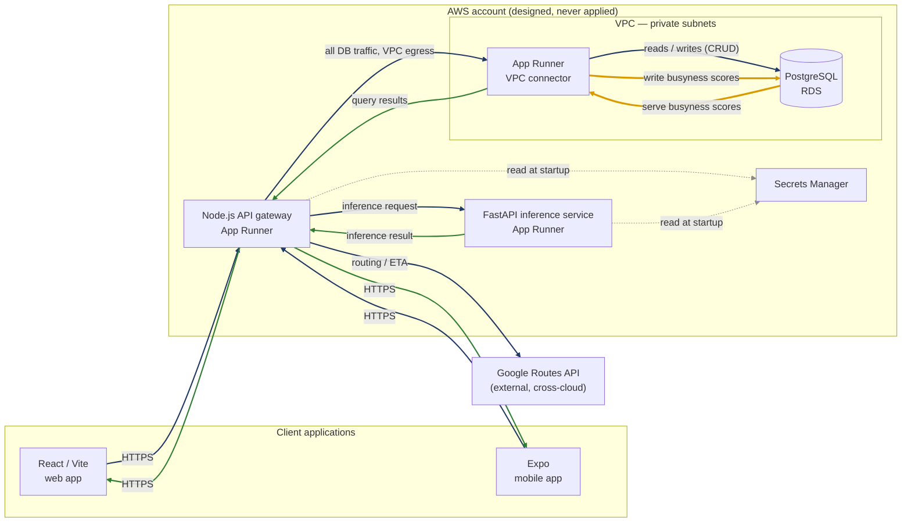

# AWS — Terraform

| Directory | Environment | Status |
| --- | --- | --- |
| [`staging/`](./staging/README.md) | Staging (design exercise) | Written 2026-07-28 as a from-scratch design mirroring GCP staging's architecture; `init`/`validate`/`fmt` clean, never `plan`'d or `apply`'d against a real account |
| `prod/` | Production | Not started |

Unlike [`../gcp/`](../gcp/README.md), nothing here is reverse-engineered
from a live deployment — TABL doesn't run on AWS today. See
[`staging/README.md`](./staging/README.md) for the architecture mapping,
what's a placeholder vs. real, and why `apply` would create real billed
infrastructure rather than just adopting existing resources.

## Runtime architecture

**This topology has never existed.** It is what `staging/` would stand up if
it were ever applied, drawn to the same conventions as the
[GCP diagram](../gcp/README.md#runtime-architecture) so the two can be read
side by side.

Edge colours match the GCP diagram: navy is a **request**, green is a
**response**, amber is the **busyness score path**. Grey dotted edges are
credential reads, not request traffic.

Three things differ from the GCP topology, and all three are consequences of
the platform rather than of the application:

- **Only the gateway egresses through the VPC connector.** `compute.tf` gives
  `api_gateway` an `egress_configuration` pointing at the connector so it can
  reach RDS on 5432 inside private subnets. `ml_service` has none, because the
  inference service never touches the database — it is handed its features in
  the request. On GCP neither service needed an equivalent, since Cloud SQL was
  reached without a VPC hop.
- **RDS is not publicly reachable.** The security group only admits 5432 from
  the connector's security group, which is why the connector exists at all.
- **Google Routes API remains a dependency.** `GOOGLE_MAPS_API_KEY` and
  `MAPS_JS_API_KEY` are provisioned in Secrets Manager, so running on AWS would
  not remove the Google dependency, only the Google *hosting*.

The busyness path behaves as it does on GCP: the gateway serves the score
already stored on the `restaurants` row and refreshes stale venues in the
background, so model latency stays out of the discovery read path.

### What Terraform covers versus what this diagram shows

| | In `staging/` Terraform | In the diagram |
| --- | --- | --- |
| App Runner (api-gateway, ml-service) | yes | yes |
| RDS, VPC, subnets, security groups, VPC connector | yes | yes |
| Secrets Manager | yes | yes, as credential reads |
| ECR, CodePipeline, CodeBuild, CodeStar, S3 artifacts | yes | no — build/release plumbing, not request-path |
| IAM roles and policies | yes | no — authorises the edges rather than forming one |
| Google Routes API | no — external, consumed via key | yes |

Two gaps are visible by comparing this against the GCP side, and both are
real rather than drawing omissions:

- **Nothing serves the web client.** GCP used Firebase Hosting, itself outside
  Terraform. The AWS design has no S3/CloudFront equivalent, so the React bundle
  currently has nowhere to be served from.
- **No push notifications.** The GCP runtime used Firebase Cloud Messaging, and
  no FCM credential is provisioned here — the secret list is `DATABASE_URL`,
  `GOOGLE_MAPS_API_KEY`, `JWT_SECRET`, `MAPS_JS_API_KEY`. Offer delivery would
  need either FCM carried over or an SNS-based replacement.
