# Azure — Terraform

**Author:** Chukwuemeka Nwoke — Integration Lead / Scrum Master

| Directory | Environment | Status |
| --- | --- | --- |
| [`staging/`](./staging/README.md) | Staging (design exercise) | Written 2026-07-28 as a from-scratch design mirroring GCP staging's architecture; `init`/`validate`/`fmt` clean, never `plan`'d or `apply`'d against a real subscription |
| `prod/` | Production | Not started |

Same status as [`../aws/`](../aws/README.md) — nothing here is
reverse-engineered from a live deployment, since TABL doesn't run on Azure
today. See [`staging/README.md`](./staging/README.md) for the architecture
mapping, the one real structural difference from GCP/AWS (CI/CD trigger is
a GitHub Actions workflow file, not an Azure resource), and why `apply`
would create real billed infrastructure.

## Runtime architecture

**This topology has never existed.** It is what `staging/` would stand up if
applied, drawn to the same conventions as the
[GCP](../gcp/README.md#runtime-architecture) and
[AWS](../aws/README.md#runtime-architecture) diagrams.

```mermaid
flowchart LR
    subgraph Clients["Client applications"]
        WEB["React / Vite<br/>web app"]
        MOB["Expo<br/>mobile app"]
    end

    subgraph AZ["Azure subscription (designed, never applied)"]
        KV["Key Vault"]
        subgraph VNET["VNet"]
            subgraph CASUB["Container Apps subnet (delegated)"]
                GW["Node.js API gateway<br/>Container App"]
                ML["FastAPI inference service<br/>Container App"]
            end
            subgraph PGSUB["Postgres subnet (delegated)"]
                DB[("PostgreSQL<br/>Flexible Server")]
            end
        end
    end

    ROUTES["Google Routes API<br/>(external, cross-cloud)"]

    WEB -->|"HTTPS"| GW
    MOB -->|"HTTPS"| GW
    GW -->|"HTTPS"| WEB
    GW -->|"HTTPS"| MOB
    GW -->|"reads / writes (CRUD)"| DB
    GW -->|"write busyness scores"| DB
    DB -->|"serve busyness scores"| GW
    GW -->|"inference request"| ML
    ML -->|"inference result"| GW
    GW -->|"routing / ETA"| ROUTES
    GW -.->|"read via managed identity"| KV
    ML -.->|"read via managed identity"| KV

    linkStyle 0,1,4,7,9 stroke:#1f3864,stroke-width:2px
    linkStyle 2,3,8 stroke:#2e7d32,stroke-width:2px
    linkStyle 5,6 stroke:#d99a00,stroke-width:3px
    linkStyle 10,11 stroke:#8a8a8a,stroke-width:1px
```

Edge colours match the GCP and AWS diagrams: navy is a **request**, green is
a **response**, amber is the **busyness score path**. Grey dotted edges are
credential reads.

What differs from the other two clouds:

- **Both apps sit inside the VNet, not just the gateway.** The Container Apps
  Environment is VNet-injected via `infrastructure_subnet_id`, so every app in
  it lands in the delegated Container Apps subnet automatically. AWS needed an
  explicit VPC connector attached to the gateway alone; here there is no
  connector to draw, because network placement is a property of the environment
  rather than of each service.
- **The database is reached by name over a private DNS zone.** Flexible Server
  is delegated into its own subnet, with
  `azurerm_private_dns_zone_virtual_network_link` making it resolvable from the
  Container Apps subnet. That link is the Azure equivalent of AWS's security
  group rule: without it, the two subnets are adjacent but the database is not
  addressable.
- **No secrets are injected as environment values.** Both apps read Key Vault
  through a user-assigned managed identity holding the Key Vault Secrets User
  role, so there is no stored credential anywhere in the path.

The busyness path behaves as on GCP and AWS: the gateway serves the score
already stored on the `restaurants` row and refreshes stale venues in the
background, keeping model latency out of the discovery read path.

### What Terraform covers versus what this diagram shows

| | In `staging/` Terraform | In the diagram |
| --- | --- | --- |
| Container Apps environment + 2 apps | yes | yes |
| Flexible Server, VNet, delegated subnets, private DNS zone + link | yes | yes |
| Key Vault + 4 secrets | yes | yes, as credential reads |
| ACR | yes | no — image distribution, not request-path |
| Managed identities, federated credential, role assignments | yes | no — authorises the edges rather than forming one |
| GitHub Actions CI/CD | no — a workflow file, not an Azure resource | no |
| Google Routes API | no — external, consumed via key | yes |

The same two gaps noted on the [AWS side](../aws/README.md#what-terraform-covers-versus-what-this-diagram-shows)
apply here and are inherited from mirroring the GCP design rather than
introduced by it: nothing serves the web client (no Static Web Apps or Storage
+ CDN equivalent to Firebase Hosting), and no push-notification credential is
provisioned, the Key Vault list being `DATABASE-URL`, `GOOGLE-MAPS-API-KEY`,
`JWT-SECRET`, `MAPS-JS-API-KEY`.

One property worth stating because the diagram implies it: the inference
service is externally reachable, `external_enabled = true` here and
`INGRESS_TRAFFIC_ALL` on GCP. That is consistent across all three configs
rather than specific to Azure, but a real deployment would likely make it
internal-only, since nothing outside the gateway needs to call it.
