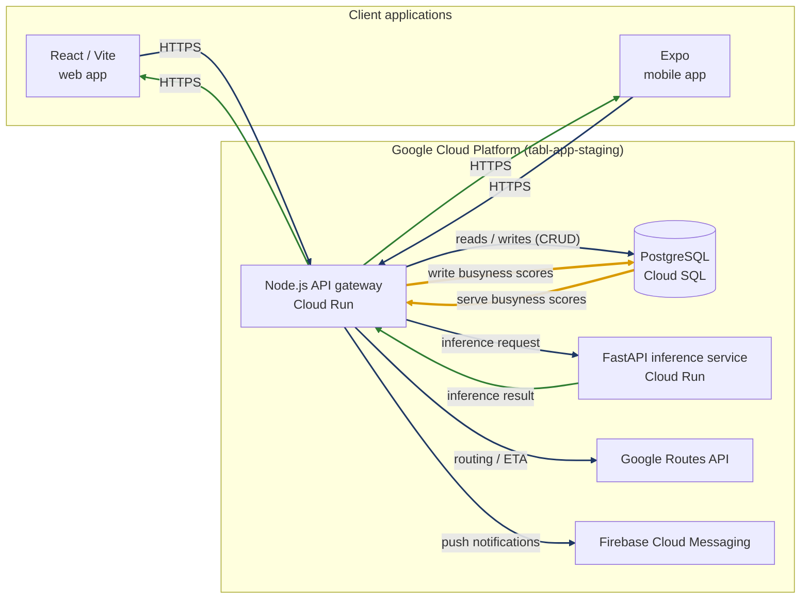

# GCP — Terraform

| Directory | Environment | GCP project | Status |
| --- | --- | --- | --- |
| [`staging/`](./staging/README.md) | Staging | `tabl-app-staging` | Reverse-engineered from live state 2026-07-28, not yet imported/applied |
| `prod/` | Production | `tabl-app-prod` | Not started |

## Runtime architecture

What the staging project actually runs, and how a request moves through it:

Edge colours: navy is a **request**, green is a **response**, amber is the
**busyness score path**.

The busyness path is worth calling out because it is the one loop that does
not behave like the others. The gateway does not call the ML service while a
user waits. It serves whatever score is already stored on the `restaurants`
row, then refreshes stale venues in the background (one-hour TTL, capped at
five venues per request) and writes the new score back. Model latency
therefore never lands in the discovery read path.

### What Terraform covers versus what this diagram shows

These two are not the same set, which is easy to misread:

| | In `staging/` Terraform | In the diagram |
| --- | --- | --- |
| Cloud Run (api-gateway, ml-service) | yes | yes |
| Cloud SQL (instance, database, user) | yes | yes |
| Artifact Registry, Cloud Build triggers, Secret Manager | yes | no — build/release plumbing, not request-path |
| Google Routes API, Firebase Cloud Messaging | no — external services, consumed via API key/SDK | yes |
| Firebase Hosting (serves the web client) | no — configured outside Terraform, see `firebase.json` | no |

So the diagram is the runtime request path, not an inventory of managed
resources. Neither is a superset of the other.

## Why "reverse-engineered"

Everything under `staging/` was infrastructure that already existed —
built by hand, step by step, through the GCP Console (see project memory:
gcp-tabl-app-deployment). These `.tf` files were written to *match* that
live state, discovered via `gcloud`, so that `terraform import` can bring
it under Terraform management with zero actual infrastructure changes.
They are not a from-scratch design.

See [`staging/README.md`](./staging/README.md) for the full import
procedure, prerequisites, and a list of infra inconsistencies discovered
along the way (unused Artifact Registry repo, mixed gcr.io/Artifact
Registry usage, pinned secret versions) that are worth fixing later but
are deliberately left as-is in this config for now.

## Prod

Not started. Once staging is confirmed importable with a clean `terraform
plan`, the same approach (describe live `tabl-app-prod` resources, write
matching `.tf`, import) should be repeated there — `tabl-app-prod` is a
fully separate GCP project per the environment-isolation decision in
project memory, so nothing here is reused directly, only used as a
template.
