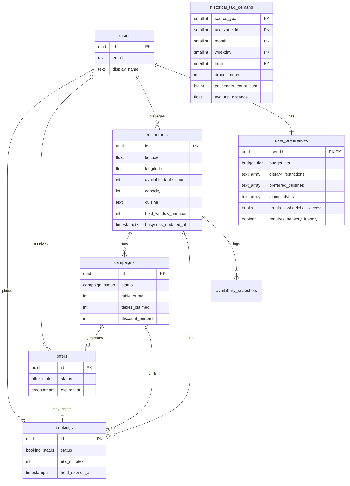

# Tablé database schema v1 (BE-2)

**Authors:** Yang Liu — Backend Lead · Chukwuemeka Nwoke — Integration Lead / Scrum Master

Entity-relationship overview for MVP. Base implementation: `migrations/001_initial_schema.sql`; schema has evolved through `migrations/014_add_restaurant_busyness_updated_at.sql` (14 migrations total as of 2026-08-05 — see `migrations/` for the full, current list, since this doc summarizes rather than enumerates every one).

## ER diagram

## P0 user story mapping

| Story | Requirement | Tables / columns |
|-------|-------------|----------------|
| **1.1** Onboarding | Categorized preferences → PostgreSQL for ML | `user_preferences.budget_tier`, `dietary_restrictions`, `preferred_cuisines`, `dining_styles` |
| **2.1** Discovery | Within 1.5 km, `available_table_count > 0` | `restaurants.latitude`, `restaurants.longitude`, `restaurants.available_table_count`; query uses haversine (app/SQL) — see README |
| **3.1 / 3.2** Booking | 15 min hold vs ETA | `restaurants.hold_window_minutes`, `bookings.eta_minutes`, `bookings.hold_expires_at`, `bookings.transport_mode` |
| **4.1** Offers | 900 s TTL, disable accept when expired | `offers.expires_at`, `offers.status` (`pending` → `expired` via app or scheduled job) |
| **5.2** Dashboard | Campaign `active` → `completed` when quota filled | `campaigns.table_quota`, `campaigns.tables_claimed`, `campaigns.status`; trigger revokes pending `offers` |
| **5.1** RevPASH | Revenue per available seat hour | `restaurants.opens_at`, `closes_at`, `avg_check_per_cover`; `bookings.party_size`, `seated_at`, `check_amount`, `duration_minutes` |
| Historical traffic proxy | Store yearly taxi-demand aggregates for model features | `historical_taxi_demand.source_year`, `taxi_zone_id`, `month`, `weekday`, `hour`, `dropoff_count` |
| **EDI** | Diner accessibility requirements enforced as a hard filter in flash-deal candidate matching (not just schema-ready — live since migration 013 / PR #119) | `user_preferences.requires_wheelchair_access`, `requires_sensory_friendly` (diner side); `restaurants.is_wheelchair_accessible`, `sensory_friendly` (venue side); enforced in `candidateUsers.js`'s SQL filter + `satisfiesAccessibilityRequirements` |

### P1 (schema-ready, optional for demo data)

| Story | Schema support |
|-------|----------------|
| 2.2 Manual neighborhood search | `restaurants.neighborhood` |
| 4.2 Cancel after accept | `bookings.status = 'cancelled'`, decrement logic in API |
| 5.1 Discount 10–50% | `campaigns.discount_percent` CHECK constraint |

## Table summaries

### `users`

Consumer profiles. Auth via JWT (`Authorization: Bearer`); seed data may use fixed UUIDs with interim `X-User-Id` header.

- `email`: unique login identifier (nullable for legacy seed users)
- `password_hash`: bcrypt hash; null for users without credentials
- `token_version`: incremented on logout to invalidate outstanding JWTs
- `password_reset_token_hash` / `password_reset_expires_at`: single-use forgot-password flow
- `budget_tier` / `dietary_tags`: temporary compatibility mirror retained by migration 011 for rollback

### `user_preferences`

One-to-one categorized preference record keyed by `user_id`.

- `budget_tier`: `TIER_1` \| `TIER_2` \| `TIER_3` (UI labels € / €€ / €€€)
- `dietary_restrictions`: requirements such as vegan, halal, or gluten-free
- `preferred_cuisines`: explicit cuisine choices used by onboarding/matching
- `dining_styles`: casual, family, date-night, or business contexts
- `requires_wheelchair_access` / `requires_sensory_friendly`: diner-side accessibility needs (migration 013); enforced as a hard filter against `restaurants.is_wheelchair_accessible` / `sensory_friendly` during flash-deal candidate matching, not just a display preference — see `candidateUsers.js`

### `restaurants`

Venue master data for Manhattan prototype.

- `available_table_count`: denormalized “live” count for map queries (updated by seeds or simulation scripts)
- `capacity`: total table capacity (upper bound; `available_table_count <= capacity`)
- `cuisine`: primary cuisine slug (e.g. `italian`, `thai`) for UI filters and ML features
- `hold_window_minutes`: default **15** (Story 3.x)
- `phone`: venue contact number (merchant registration)
- `opens_at` / `closes_at`: local operating hours (RevPASH denominator)
- `avg_check_per_cover`: benchmark average spend per cover until POS data exists
- `busyness_score`: optional 0–1 signal from ML pipeline
- `busyness_updated_at`: timestamp of the last successful ml-service refresh (migration 014); `NULL` means never scored. Drives `GET /restaurants/nearby`'s stale-venue refresh (only re-scores venues past a TTL, not every venue on every request) — deliberately separate from `updated_at`-style triggers, since `available_table_count` changes far more often than busyness should trigger a re-score
- `rating`: nullable external aggregate score constrained to 0.0–5.0
- `reviews`: nullable non-negative external aggregate review count
- `manager_user_id`: links B-side dashboard to a user row

### `campaigns`

Restaurant-triggered lull-mitigation runs.

- `table_quota` / `tables_claimed`: when claimed ≥ quota → `completed` (DB trigger)
- `discount_percent`: enforced **10–50** at DB level
- `expires_at`: campaign TTL end — set from manager `ttlMinutes` (default **15**, range 10–60); same value applied to offers
- `status`: `active` → `completed` (quota), `cancelled` (manager), or `expired` (TTL; lazy on read)

### `offers`

Per-user flash deal inbox entries (1-to-1).

- `expires_at`: set to `created_at + 900 seconds` when inserting (application responsibility)
- Unique `(campaign_id, user_id)` prevents duplicate inbox rows

### `bookings`

Standard or deal-backed reservations.

- On `confirmed` with `campaign_id`, trigger increments `tables_claimed` and may complete campaign
- `eta_minutes` stored at booking time for audit/demo
- `party_size`: diner-entered headcount (RevPASH revenue multiplier)
- `seated_at`: check-in timestamp; falls back to `confirmed_at` when absent
- `check_amount`: simulated check total (`party_size × avg_check_per_cover × discount`)
- `duration_minutes`: simulated turn time (default 90 min)
- **One active booking per user:** unique partial index `idx_bookings_one_active_per_user` on `user_id` where `status IN ('pending', 'confirmed')` (migration `009`)
- **Hold timeout:** API lazily cancels `pending`/`confirmed` rows when `hold_expires_at <= now` (no cron in MVP)
- **History cap:** API keeps the newest 5 booking rows per user after each create

### `availability_snapshots`

Append-only history for simulated availability (see [docs/data-strategy.md](../docs/data-strategy.md)).

### `historical_taxi_demand`

Static taxi drop-off aggregates for ML proxy features. The composite primary key
enforces one row per source year, taxi zone, month, weekday, and hour.

- `weekday`: Pandas convention, Monday `0` through Sunday `6`
- `dropoff_count` / `passenger_count_sum`: non-negative aggregate counts
- `avg_trip_distance`: nullable non-negative mean distance in miles
- Migration 012 creates only the schema; importing source data is a separate operation

### `restaurant_revpash_hourly` (view)

Hourly RevPASH buckets in **America/New_York** local time.

| Column | Meaning |
|--------|---------|
| `restaurant_id` | Venue |
| `bucket_start` | Hour bucket start (local) |
| `total_revenue` | Sum of `bookings.check_amount` seated in the hour |
| `available_seat_hours` | `restaurants.capacity` for each open hour |
| `booking_count` | Confirmed/completed bookings in the hour |
| `revpash` | `total_revenue / available_seat_hours` |

The view includes **zero-revenue open hours** for days with booking activity plus the current local day, so `GET /revpash?window=today` can sum the full operating denominator.

## Geospatial approach

| Approach | Used in v1 | Notes |
|----------|------------|--------|
| `latitude` / `longitude` columns | **Yes** | Simple local Postgres; no extension required |
| Haversine in SQL or Node | **Recommended for MVP** | 1.5 km filter in `GET /restaurants/nearby` |
| PostGIS `GEOGRAPHY` | Optional later | See `migrations/002_postgis_optional.sql` if team standardizes on Docker PostGIS |

Radius constant for discovery: **1500 metres** (product spec).

## ML integration (BE-7 prep)

Columns likely used as model features:

- `user_preferences`: `budget_tier`, `dietary_restrictions`, `preferred_cuisines`, `dining_styles`
- `users`: `last_lat`, `last_lng`
- `restaurants`: `busyness_score`, `neighborhood`, EDI flags
- `availability_snapshots`: time-series busyness for training
- `historical_taxi_demand`: static zone/time taxi-demand proxy features

Matching output creates `offers` rows for a `campaign_id` + `user_id`.
