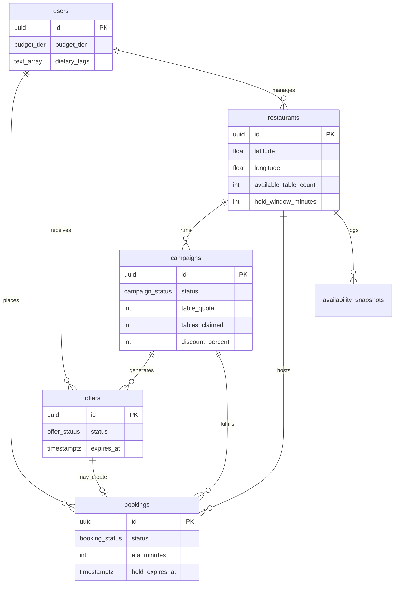

# Tablé database schema v1 (BE-2)

Entity-relationship overview for Sprint 1. Implementation: `migrations/001_initial_schema.sql`.

## ER diagram

## P0 user story mapping

| Story | Requirement | Tables / columns |
|-------|-------------|----------------|
| **1.1** Onboarding | Budget tier + dietary tags → PostgreSQL for ML | `users.budget_tier`, `users.dietary_tags` |
| **2.1** Discovery | Within 1.5 km, `available_table_count > 0` | `restaurants.latitude`, `restaurants.longitude`, `restaurants.available_table_count`; query uses haversine (app/SQL) — see README |
| **3.1 / 3.2** Booking | 15 min hold vs ETA | `restaurants.hold_window_minutes`, `bookings.eta_minutes`, `bookings.hold_expires_at`, `bookings.transport_mode` |
| **4.1** Offers | 900 s TTL, disable accept when expired | `offers.expires_at`, `offers.status` (`pending` → `expired` via app or scheduled job) |
| **5.2** Dashboard | Campaign `active` → `completed` when quota filled | `campaigns.table_quota`, `campaigns.tables_claimed`, `campaigns.status`; trigger revokes pending `offers` |

### P1 (schema-ready, not required for Sprint 1 demo data)

| Story | Schema support |
|-------|----------------|
| 2.2 Manual neighborhood search | `restaurants.neighborhood` |
| 4.2 Cancel after accept | `bookings.status = 'cancelled'`, decrement logic in API (Sprint 3) |
| 5.1 Discount 10–50% | `campaigns.discount_percent` CHECK constraint |
| EDI | `restaurants.is_wheelchair_accessible`, `restaurants.sensory_friendly` |

## Table summaries

### `users`

Consumer profiles. Dummy auth can use fixed UUIDs in seed data.

- `budget_tier`: `TIER_1` \| `TIER_2` \| `TIER_3` (UI labels € / €€ / €€€)
- `dietary_tags`: PostgreSQL `TEXT[]` for ML features

### `restaurants`

Venue master data for Manhattan prototype.

- `available_table_count`: denormalized “live” count for map queries (updated by seeds or simulation scripts)
- `hold_window_minutes`: default **15** (Story 3.x)
- `busyness_score`: optional 0–1 signal from ML pipeline
- `manager_user_id`: links B-side dashboard to a user row

### `campaigns`

Restaurant-triggered lull-mitigation runs.

- `table_quota` / `tables_claimed`: when claimed ≥ quota → `completed` (DB trigger)
- `discount_percent`: enforced **10–50** at DB level

### `offers`

Per-user flash deal inbox entries (1-to-1).

- `expires_at`: set to `created_at + 900 seconds` when inserting (application responsibility)
- Unique `(campaign_id, user_id)` prevents duplicate inbox rows

### `bookings`

Standard or deal-backed reservations.

- On `confirmed` with `campaign_id`, trigger increments `tables_claimed` and may complete campaign
- `eta_minutes` stored at booking time for audit/demo

### `availability_snapshots`

Append-only history for simulated OpenTable / NYC data feeds (Sprint 2+ ETL).

## Geospatial approach

| Approach | Used in v1 | Notes |
|----------|------------|--------|
| `latitude` / `longitude` columns | **Yes** | Simple local Postgres; no extension required |
| Haversine in SQL or Node | **Recommended for MVP** | 1.5 km filter in `GET /restaurants/nearby` |
| PostGIS `GEOGRAPHY` | Optional later | See `migrations/002_postgis_optional.sql` if team standardizes on Docker PostGIS |

Radius constant for discovery: **1500 metres** (product spec).

## ML integration (BE-7 prep)

Columns likely used as model features:

- `users`: `budget_tier`, `dietary_tags`, `last_lat`, `last_lng`
- `restaurants`: `busyness_score`, `neighborhood`, EDI flags
- `availability_snapshots`: time-series busyness for training

Matching output creates `offers` rows for a `campaign_id` + `user_id`.
