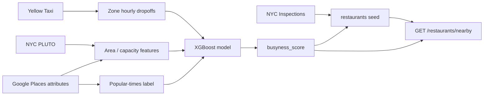

# Tablé Data Strategy (BE-5)

**Authors:** Yang Liu — Backend Lead · Chukwuemeka Nwoke — Integration Lead / Scrum Master  
**Owners:** Backend Lead + Data & ML Lead  
**Related:** [ADR-001](./adr/ADR-001.md) · [docs/architecture/database-schema.md](./database-schema.md) · [api-contract-v0.md](./api-contract-v0.md)

---

## 1. Purpose

This document defines:

1. **≥2 Manhattan-relevant open datasets**
2. How **busyness** and **table availability** are represented in the MVP
3. **Data quality** risks and mitigations
4. How **simulated “live”** updates replace production restaurant APIs (per business plan risk #2)

Tablé does **not** use paid OpenTable Partner APIs, and does **not** call Google
Places (or any other venue API) at request time. Google Places attributes *are*
used, ingested offline into a static feature table — see Dataset C.

> **Corrected 2026-08-07.** Revisions of this document up to 2026-08-06 described
> the ML training source as "OpenTable-style reservation patterns". No OpenTable
> data exists anywhere in `ml-pipeline/`. The shipped model trains on the Google
> Places popular-times index. Dataset C, §4, §5 and §6 below are corrected
> accordingly; see [ADR-001](./adr/ADR-001.md) revision 6, ADR-001-E.

---

## 2. Busyness and availability definitions

### 2.1 Terms

| Term | Meaning in Tablé | Stored where |
|------|------------------|--------------|
| **Busyness** | How crowded a venue or area is (0 = quiet, 1 = very busy) | `restaurants.busyness_score`, `availability_snapshots.busyness_score` |
| **Available tables** | Integer count of tables the platform will offer for immediate booking **right now** | `restaurants.available_table_count` |
| **Live availability** | Value shown on the map at query time | Denormalized on `restaurants`; history in `availability_snapshots` |

### 2.2 Primary MVP metric (product / P0 stories)

**Discovery filter (Story 2.1):** show restaurant only if  

`available_table_count > 0` **and** distance ≤ **1500 m**.

**Map / ML feature (analytics):** `busyness_score ∈ [0, 1]`.

### 2.3 How we derive values (MVP — simulated)

Production reservation feeds are unavailable. MVP uses a **two-layer model**:

```text
Historical signals (datasets below)
        ↓
  ML / heuristic busyness_score (by restaurant, hour, DOW)
        ↓
  Simulation rule → available_table_count
        ↓
  Optional: cron or manual script updates Postgres + snapshots
```

**Simulation rule (v0 — interpretable default):**

```text
base_tables = seed constant per restaurant (e.g. 4–12)
hour_factor = f(busyness_score)   # e.g. round(base_tables * (1 - busyness_score))
available_table_count = max(0, hour_factor - active_bookings)
```

- `active_bookings` = count of `bookings` with status `pending` or `confirmed` for that restaurant.
- Demo script can bump counts every N minutes to mimic “lulls” for flash deals.

**ML enhancement:** Data & ML replaces `f()` with a trained regressor/classifier using features in §5.

---

## 3. Dataset inventory (≥2 primary + 1 optional)

### Dataset A — NYC restaurant locations & metadata (primary)

| Field | Value |
|-------|--------|
| **Name** | DOHMH New York City Restaurant Inspection Results |
| **Portal** | [NYC Open Data](https://opendata.cityofnewyork.us/) |
| **Dataset page** | https://data.cityofnewyork.us/Health/DOHMH-New-York-City-Restaurant-Inspection-Results/43nn-8n43j |
| **License** | NYC Open Data Terms of Use (free, public) |
| **Update** | Periodic inspections (not real-time occupancy) |
| **Manhattan use** | Filter `BORO` = `Manhattan` (or borough code `1`) |

**Key columns (expected):**

| Column | Use in Tablé |
|--------|----------------|
| `CAMIS` | Stable external restaurant id → seed `restaurants.id` mapping table |
| `DBA` / `NAME` | `restaurants.name` |
| `BUILDING`, `STREET`, `ZIPCODE`, `BORO` | Address / `neighborhood` |
| `LATITUDE`, `LONGITUDE` | Discovery haversine (when present) |
| `CUISINE DESCRIPTION` | ML features, UI tags |
| `INSPECTION DATE` | Not occupancy — metadata only |

**Role:** Authoritative **restaurant dimension** for Manhattan POIs in Postgres seed (BE-9).

---

### Dataset B — NYC Yellow Taxi trips 2020 (primary — busyness proxy)

| Field | Value |
|-------|--------|
| **Name** | 2020 Yellow Taxi Trip Data |
| **Portal** | https://data.cityofnewyork.us/Transportation/2020-Yellow-Taxi-Trip-Data/kxp8-n2sj |
| **License** | NYC Open Data (free) |
| **Grain** | One row per trip; pickup/dropoff datetime and coordinates |
| **Manhattan use** | Filter `PULocationID` / `DOLocationID` in Manhattan zone IDs (TLC taxi zone lookup table, also on NYC Open Data) |

**Key columns:**

| Column | Use in Tablé |
|--------|----------------|
| `tpep_pickup_datetime` | Time bucket (hour, DOW) |
| `DOLocationID` / dropoff lat-lng if derived | Spatial aggregation near restaurant |
| `trip_distance`, `fare_amount` | Optional features |

**Role:** Proxy for **area busyness** — aggregate dropoff counts per taxi zone per hour → normalize to `busyness_score` for restaurants in that zone.

**Join to restaurants:**  
Restaurant `(lat, lng)` → taxi zone polygon (spatial join or nearest zone centroid) → hourly dropoff counts.

---

### Dataset C — Google Places venue attributes and popular times (primary — ML label)

| Field | Value |
|-------|--------|
| **Name** | Google Places venue attributes and popular-times index for 2,815 Manhattan restaurants |
| **Grain** | One row per (restaurant, weekday, hour) — 367,437 observations |
| **Collection** | Ingested **offline** into `ml-pipeline/fastapi-app/data/restaurant_features.parquet`; never queried at request time |
| **Fields used** | `popular_times` index (0–100), rating, review count, typical visit duration text, coordinates |

**Role:** Supplies the **supervised label**. The popular-times index is discretised
into the three ordinal classes (*No Wait* / *Queue Required* / *Severe Queue*) the
model predicts, and its venue attributes are core features.

**Important caveat:** popular times is a **published activity proxy, not observed
occupancy or queue length**. Google derives it from aggregated location history
under an unpublished methodology, over users who opted in. A model that predicts
it well is faithful to that index, not necessarily to the wait at the door. Any
claim made from this data must be stated in those terms.

---

### Dataset D — NYC PLUTO land use (primary — capacity proxy)

| Field | Value |
|-------|--------|
| **Name** | Primary Land Use Tax Lot Output (PLUTO), Manhattan extract |
| **Portal** | [NYC Open Data](https://opendata.cityofnewyork.us/) |
| **License** | NYC Open Data Terms of Use (free, public) |
| **Manhattan use** | `manhattan_pluto.csv` in `ml-pipeline/notebooks/` |

**Role:** Commercial floor area per lot → estimated restaurant floor area, which
feeds the seating-capacity and turnover features.

---

### Supplementary (not counted as primary)

| Source | Use |
|--------|-----|
| [OSM Overpass](https://overpass-turbo.eu/) / Geofabrik NYC extract | Extra POIs, cuisine tags if inspection data thin |
| TLC Taxi Zone shapefile | Zone polygons for taxi join |
| Internal `availability_snapshots` | Ground truth for “what we showed users” after simulation |
| Cuisine profile table | Cuisine-specific turnover rate and takeaway ratio, derived from industry reports |

---

## 4. Join and pipeline strategy



### 4.1 Manhattan boundary

- Restaurants: `BORO = Manhattan` from Dataset A, or lat/lng bounding box (~40.70–40.88, -74.02–-73.91) for seed consistency with demo map.

### 4.2 Identifier strategy

| Layer | ID |
|-------|-----|
| External | `CAMIS` (inspections), TLC `LocationID` (taxi) |
| Internal | `restaurants.id` UUID (BE-2) |
| Mapping | `restaurant_external_ids` table optional; or CSV column in seed file |

### 4.3 ETL phases

| Phase | Output |
|-------|--------|
| **P1 Sample** | Download ≤50k taxi rows + Manhattan inspections subset; notebook/CSV proof |
| **P2 Seed** | `database/seeds/` from inspections |
| **P3 Aggregates** | Hourly zone busyness parquet/CSV |
| **P4 Simulator** | Node or Python job writes `available_table_count` + `availability_snapshots` |
| **P5 ML** | FastAPI serves `busyness_score` override |

---

## 5. Feature list for ML (BE-7 / FastAPI)

**Shipped feature set** (corrected 2026-08-07 to match the trained pipeline):

| Feature | Source |
|---------|--------|
| `hour_sin`, `hour_cos` — cyclical hour encoding | Observation timestamp |
| `friday`, `saturday`, `sunday` — binary indicators | Observation date |
| `rating` | Dataset C |
| `log(1 + review_count)` — skewness 13.6 untransformed | Dataset C |
| `typical_visit_duration` (minutes, median-imputed) | Dataset C |
| `log(estimated_area)` | Dataset D |
| `turnover_rate`, `takeaway_ratio` — cuisine-derived | Cuisine profile table |
| `log(1 + taxi_dropoffs)` for the venue's zone/weekday/hour | Dataset B |
| `taxi_zone_id` — one-hot, `handle_unknown="ignore"` | TLC zone shapefile |

**Shipped target:** three-class ordinal classification of the popular-times index —
`0` (index = 0, *No Wait*), `1` (0 < index ≤ 50, *Queue Required*), `2` (index > 50,
*Severe Queue*). Classes are near-balanced, so accuracy is interpretable against a
33% random baseline.

**Not used.** The earlier draft listed `rolling_busyness_7d`, `neighborhood`,
`cuisine`, `user.budget_tier` and `distance_meters` as busyness features. None
of these enter the busyness model. `distance_meters` and the user preference
fields belong to the **flash-deal matching heuristic**, which is a separate,
unlearned scoring function — see [ADR-001-C](./adr/ADR-001.md).

---

## 6. Data quality issues and mitigations

| Issue | Impact | Mitigation |
|-------|--------|------------|
| Missing `LATITUDE`/`LONGITUDE` in inspections | Cannot place on map | Geocode from address (one-time); or drop row; OSM fallback |
| Inspection data ≠ live occupancy | Misleading if labeled “real-time” | UI copy: “predicted / simulated”; use taxi + model, not inspection grade |
| Taxi 2020 only (COVID bias) | Skews busyness vs 2026 demo | Document in paper; use relative hour-of-week patterns; optional downsample |
| Large taxi files | Local EDA slow | Use 1–3 month sample; Parquet; aggregate before join |
| Duplicate `CAMIS` / name changes | Duplicate restaurants | Dedupe by `CAMIS`, keep latest inspection |
| Zone ↔ restaurant spatial error | Wrong busyness | Nearest zone; validate with map spot check |
| No live reservation feed of any kind | No true `available_table_count` | **Simulation rule** (§2.3); bookings decrement count in app |
| Popular-times is a proxy, not occupancy | Model accuracy measures fidelity to a published index, not to real queue length | State it explicitly wherever figures are quoted; ground truth listed as future work |
| Zone taxi demand explains little between-zone variance on its own | Overstating the taxi feature's contribution | Report it as one feature among twelve, not a standalone busyness index |

---

## 7. Mapping to PostgreSQL (BE-2)

| Table / column | Populated from |
|----------------|----------------|
| `restaurants` | Dataset A seed (+ manual demo tweaks) |
| `restaurants.busyness_score` | Dataset B aggregates + ML |
| `restaurants.available_table_count` | Simulation job − active bookings |
| `availability_snapshots` | Append each simulation tick or hourly cron |
| `user_preferences` | App onboarding only |
| `bookings` | Runtime API (reduces availability) |
| `campaigns` / `offers` | B-side + ML match (not from open data) |

---

## 8. Verification checklist

- [x] ≥2 named open datasets with URLs and Manhattan filter
- [x] Busyness vs `available_table_count` defined
- [x] Simulation approach documented (no live reservation API)
- [x] Quality risks + mitigations listed
- [x] Join path to `restaurants` and ML features
- [ ] Data & ML sign-off (comment in Jira / PR)
- [x] Demo seed for development — `database/seeds/` (BE-9)
- [ ] EDA notebook link in `ml-pipeline/notebooks/`

---

## 9. Remaining action items

| Owner | Task |
|-------|------|
| Data & ML | Taxi zone aggregation; deploy trained model to FastAPI |
| Backend | Simulator script updating `available_table_count` |
| Backend | Wire live `busyness_score` from ML into `GET /restaurants/nearby` |
| Product | Paper wording: “simulated availability from open data” |

---

## 10. Cost and compliance

| Item | MVP stance |
|------|------------|
| Paid datasets | **Not used** |
| Google Places | **Not** primary inventory (ADR-001-E) |
| Google Routes API | ETA only (BE-12), not busyness |
| Storage | Local Postgres + files; Cloud SQL optional for deployment |

---

## 11. RevPASH metric — data acquisition

RevPASH (`total_revenue / available_seat_hours`) measures whether flash deals
lift off-peak revenue without diluting peak pricing. It needs new fields on
`restaurants` and `bookings` (see `docs/architecture/database-schema.md`); this table documents
where each one comes from and whether it's real or simulated, following the
same pattern as §2.3 above.

| Data point | How it's gotten | Real or simulated |
|---|---|---|
| `restaurants.seat_capacity` | Merchant enters it once at onboarding (physical fact about the venue) | **Real** — one-time manual input |
| `restaurants.opens_at` / `closes_at` | Merchant onboarding input, or enriched from Google Places' `regularOpeningHours` | **Real** — merchant-entered or externally sourced |
| `restaurants.avg_check_per_cover` | No POS to pull this from yet — seeded from a cuisine/neighborhood benchmark, then updated from real `check_amount` averages as data accumulates | **Simulated at launch**, becomes real over time |
| `bookings.party_size` | User enters it when booking a table | **Real** — direct user input |
| `bookings.seated_at` | Ideally a real event (host taps "seated" at check-in); falls back to `confirmed_at` if that flow doesn't exist yet | **Real if check-in exists, simulated proxy otherwise** |
| `bookings.check_amount` | No payment/POS integration exists — computed as `party_size × avg_check_per_cover × (1 − discount if campaign)` | **Simulated** — same category as `available_table_count`/`busyness_score` |
| `bookings.duration_minutes` | No real turn-time tracking — defaulted to a constant (e.g. 90 min) unless a real `departed_at` is later captured | **Simulated** |

**Takeaway:** capacity and hours are one-time facts, party size is genuinely
real (typed in by the user) — the only two fields that must be faked are
`check_amount` and turn-time, and both fall into the same "simulate until we
have a real feed" bucket as `available_table_count` and `busyness_score`, so
RevPASH doesn't introduce a new category of data problem.

---

## 12. Full entity classification — actual vs simulated

§2.3 and §11 classify busyness/availability and RevPASH fields specifically.
This section extends the same real-vs-simulated lens to every column across
every table (BE-2 schema), as the single canonical reference — update it
whenever a migration adds a field or an enrichment script (e.g.
`enrich-places.js`) actually gets run and flips a column from simulated to
real in practice.

### `users` and `user_preferences`

| Column | Classification | Why |
|---|---|---|
| `user_preferences.budget_tier`, `dietary_restrictions`, `preferred_cuisines`, `dining_styles` | **Actual** | Typed in by the user at onboarding |
| `email`, `password_hash` | **Actual** | Real auth credentials |
| `last_lat` / `last_lng` | **Actual** | Real device/browser location at last use |
| `token_version`, `password_reset_token_hash` / `password_reset_expires_at` | **Actual** (system-generated, not a business signal) | Auth bookkeeping |

### `restaurants`

| Column | Classification | Why |
|---|---|---|
| `name`, `address_line`, `latitude` / `longitude`, `cuisine` | **Actual** | Sourced from the real NYC DOHMH inspection dataset via `generate-seed.js` |
| `neighborhood` | **Actual** | Resolved from real NYC NTA boundary polygons (`database/scripts/geo/ntaLookup.js`), not a guess |
| `phone`, `is_wheelchair_accessible` | **Hybrid** | Real wherever `enrich-places.js` has matched a restaurant via Places API (New) — **not yet run as of 2026-07-13**, so every value in production is currently still the deterministic simulated fallback |
| `opens_at` / `closes_at` | **Actual** | Merchant-entered at registration, or Places-enriched |
| `capacity` | **Actual** | Merchant-entered once at onboarding (§11) |
| `avg_check_per_cover` | **Simulated at launch, becomes real over time** | No POS integration; seeded from a cuisine/neighborhood benchmark, intended to be replaced by real `check_amount` averages as bookings accumulate |
| `hold_window_minutes`, `sensory_friendly`, `manager_user_id` | **Simulated/operational** | No public dataset backs these; deterministically seeded per restaurant |
| `available_table_count` | **Simulated** | Simulation rule (§2.3) — no live POS/reservation feed exists |
| `busyness_score` | **Hybrid, split by surface** | **Real** for the merchant detail view (`GET /restaurants/:id`) — computed live from NYC taxi-dropoff + pedestrian-count data via the ml-service. Still the **static seeded** value on the diner-facing `GET /restaurants/nearby` list (known gap — not yet wired, see RISK_REGISTER R-10) |
| `rating`, `reviews` | **Actual when populated** | External aggregate rating and review count; nullable until a trusted enrichment/import process supplies them |

### `campaigns` / `offers`

All columns — **Actual**. Not derived from any open dataset; real B-side merchant actions (`table_quota`, `discount_percent`) and real system-generated inbox state (`status`, `expires_at`), per §7 ("not from open data").

### `bookings`

| Column | Classification | Why |
|---|---|---|
| `user_id`, `restaurant_id`, `status`, `transport_mode`, `hold_expires_at`, `confirmed_at` / `cancelled_at` | **Actual** | Real user actions and system state |
| `eta_minutes` | **Hybrid** | Actual when the Google Routes API call succeeds (`source: "google"`); haversine `"estimate"` fallback otherwise |
| `party_size` | **Actual** | Direct diner input (§11) |
| `seated_at` | **Hybrid** | Real if a host check-in flow fires; falls back to `confirmed_at` as a proxy otherwise (§11) |
| `check_amount` | **Simulated** | No payment/POS integration — computed as `party_size × avg_check_per_cover × discount` (§11) |
| `duration_minutes` | **Simulated** | No real turn-time tracking — constant default (90 min) (§11) |

### `availability_snapshots`

| Column | Classification | Why |
|---|---|---|
| `available_table_count` | **Simulated** | Snapshot of the simulation rule's output, not real occupancy |
| `busyness_score` | **Hybrid** | Real ml-service output when written via the merchant-detail busyness pipeline; simulated otherwise |

### `restaurant_revpash_hourly` (view)

**Derived**, not its own data — inherits its ingredients' classification. `total_revenue` is built from `check_amount` (simulated) × real `party_size`, so the RevPASH metric itself is currently a **simulated** number, in the same category as `available_table_count`.

---

## Changelog

| Version | Date | Notes |
|---------|------|-------|
| v0 | 2026-06-02 | Initial BE-5 strategy |
| v1 | 2026-07-04 | Routes API naming; align with ADR-001 rev 4 |
| v2 | 2026-07-06 | Add §11 RevPASH metric data acquisition (real vs simulated) |
| v3 | 2026-07-13 | Add §12 full entity classification (actual vs simulated) across every table, consolidating the pattern from §2.3/§7/§11 |
