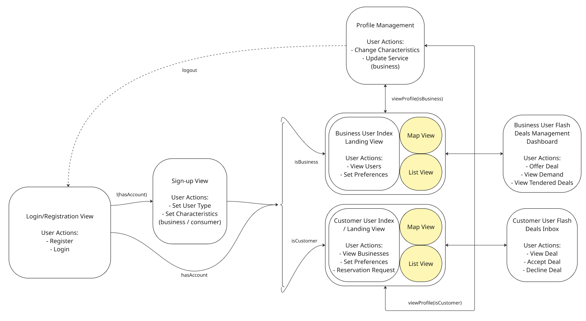
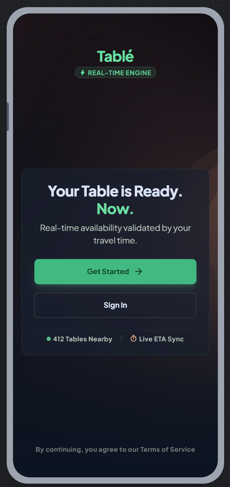
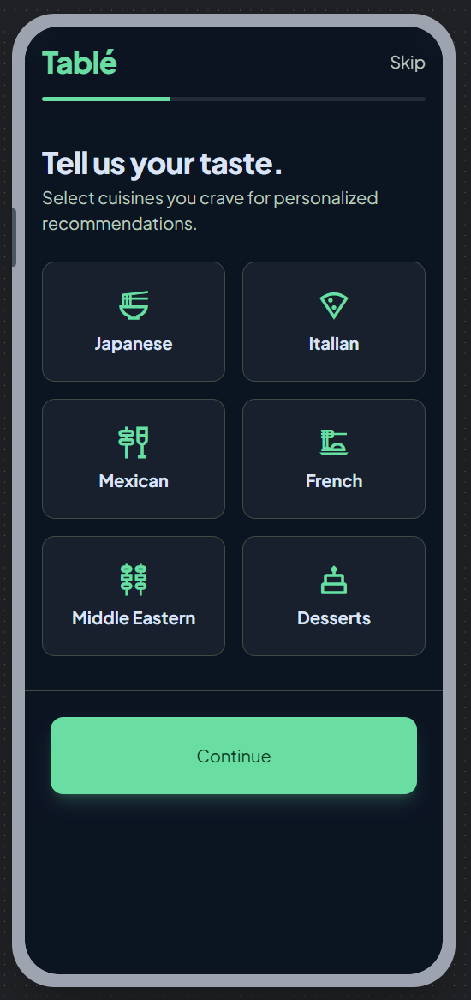
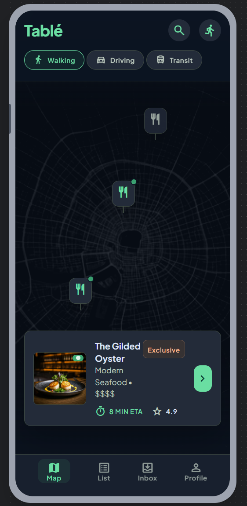
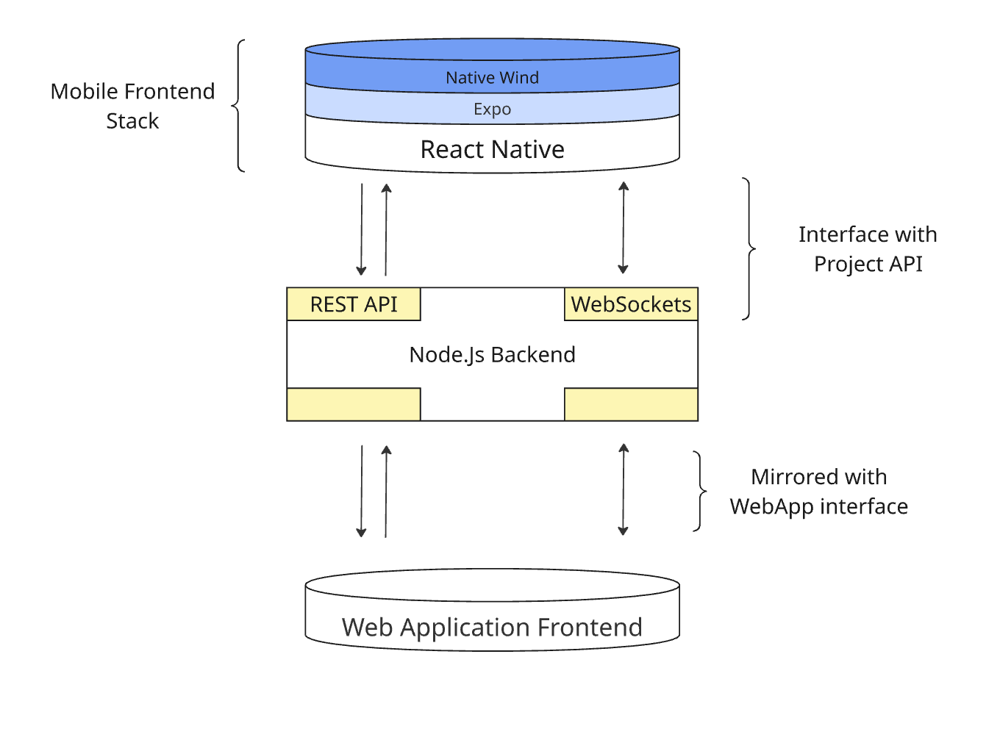
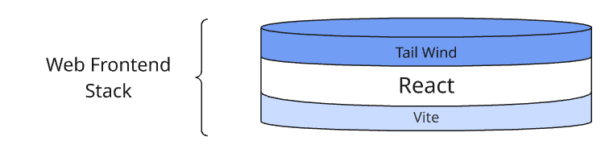

# Tablé Frontend Strategy (FE-1)

**Owners:** Frontend Lead + Mobile Lead  
**Related:** [ADR-001](./adr/ADR-001.md) · [User Stories](../product/user-stories)

---

## 1. Purpose

This document outlines the frontend implementation plan for the Tablé application interface:

1. Outline a **page flow** for implementing all acceptance criteria outlined in the user stories.
2. Create **mockups** of user flow for both mobile and web platforms.
3. Outline the **tech stack** used by both Web and Mobile Frontend platforms.
4. Define **network sync** (REST polling) and **authentication** (JWT).
5. Outline a **communication protocol** between Frontend + Mobile Leads.

---

## 2. View Architecture & Detailed Page Flow

To support both mobile and web deployment, the application uses shared page flow design.



### 2.1 Authentication Gate

* **Login/Registration View:** Entry point where users sign in or register to obtain a JWT session.
* Unauthenticated traffic is blocked from protected application routes.

> **Authentication Strategy:** JWT issued by `POST /api/v1/auth/login` and `POST /api/v1/auth/register`. Clients store the token and send `Authorization: Bearer <jwt>` on protected API calls. The mobile app has migrated: its entry route is a login/registration view that stores the session (userId + JWT) in the shared Redux auth slice, and the tab navigator redirects unauthenticated users back to it. The `X-User-Id` header remains supported for web dev/demo flows until the web app migrates. Biometric login (mobile only) is a deferred optional enhancement.

### 2.2 Index / Landing Dashboard

#### Shared components

* **Preference Queries:** Toggle travel methods (walking, driving, transit) and culinary preferences. Changing travel mode refreshes ETA; preferences filter discovery results.
* **Layout Structure:** Toggle between map and card list while retaining shared filter state.

```text
                  [ Shared Filter State Updated ]
                                │
        ┌───────────────────────┴───────────────────────┐
        ▼                                               ▼
[ Map View Update ]                            [ List View Update ]
- Repositions pins within boundaries            - Sorts cards by chosen metric
- Adjusts routing overlay markers              - Renders details based on state
- Updates busyness badges on refetch           - Highlights flash deals on refetch
```

#### Map View

* **Spatial Visualisation:** Restaurants with `availableTableCount > 0` within 1.5 km.
* **Spatial Discovery:** Authenticated users land on a map of Manhattan restaurants; data refreshes via REST (`GET /restaurants/nearby`) on location change or pull-to-refresh.

> **[User Story 2](../product/user-stories/02-discovery.md):** Manual neighbourhood input when GPS is denied.  
> **Location updates:** Client polls device location (expo-location on mobile); sends updated coordinates when the user moves beyond a threshold.

#### Card List View

* **Card Visualisation:** Detailed restaurant cards including cuisine and distance.
* **Sorting:** By relevance, distance, or price tier.

### 2.3 Business Demand Management Dashboard

> **Removed from mobile scope (2026-07-12):** the previously planned conditional rendering of a B-side dashboard (flash deals, occupancy) inside the mobile app has been dropped. The merchant experience lives exclusively in the web app (`/merchant`, see §4 Web Stack); the mobile app is consumer-only (C-side).

---

## 3. Application Mockups

<details>
<summary><b>Step 1: Login & Authentication (Click to expand)</b></summary>


</details>

<details>
<summary><b>Step 1.2: Preference Setup - Customer</b></summary>


</details>

<details>
<summary><b>Step 2: Interactive Map View</b></summary>


</details>

---

## 4. Tech Stack & File Organisation

### Mobile Stack



* **Mobile Engine:** **React Native** via **Expo**.
* **Styling:** **NativeWind** (Tailwind for React Native).
* **State / API:** Redux Toolkit + `@shared/apiSlice` (RTK Query) → REST at `http://localhost:3001/api/v1`.
* **Push notifications:** expo-notifications (optional); offers inbox also polled via REST.

### Web Stack



* **Web Engine:** **React 19** + **Vite** + **Tailwind CSS**.
* **Routing:** React Router.
* **B-side focus:** Merchant dashboard (`/merchant`), explore, profile setup.
* **API integration:** Migrate from mock services to `@shared/apiSlice` (same contract as mobile).

### Project organisation (mobile)

```text
frontend/mobile-app/
├── src/
│   ├── app/
│   │   ├── _layout.tsx
│   │   ├── index.tsx          # login / registration gate
│   │   ├── onboarding.tsx     # preference wizard (post-registration)
│   │   └── tabs/
│   │       ├── MapTab.native.tsx
│   │       ├── CardTab.tsx
│   │       ├── InboxTab.tsx
│   │       └── ProfileTab.tsx
│   └── components/
│       ├── BookingCheckout.tsx
│       ├── LocationComponent.tsx
│       └── PreferenceFilters.tsx
frontend/packages/shared/      # apiSlice, types, auth slice
```

---

## 5. Network Sync & State Management

| Protocol | Use Case | Details |
|----------|----------|---------|
| **REST requests** | Auth, discovery, bookings, offers, campaigns | RTK Query caches responses; invalidates on mutations. |
| **REST polling / refetch** | Offer inbox, map availability, busyness badges | Clients refetch on tab focus, pull-to-refresh, or interval (e.g. inbox). No WebSocket in MVP. |
| **Push notifications (mobile)** | New flash deal alerts | Optional complement to inbox polling via expo-notifications. |

Per [ADR-001-G](./adr/ADR-001.md), WebSockets are deferred; REST polling is the MVP approach.

---

## 6. Collaboration Protocol

### Frontend & Mobile Lead Sync

Independent development cycles with weekly alignment. Async updates on Discord.

**Weekly standup (Wednesday, 15 min):** progress, blockers, styling consistency across web and mobile.

---

## 7. Push Notification Strategy

Push notifications (mobile) use `expo-notifications`: the client registers a push token and sends it to the backend. A listener on the main app shell handles incoming notifications. Inbox state still syncs via REST for consistency.
