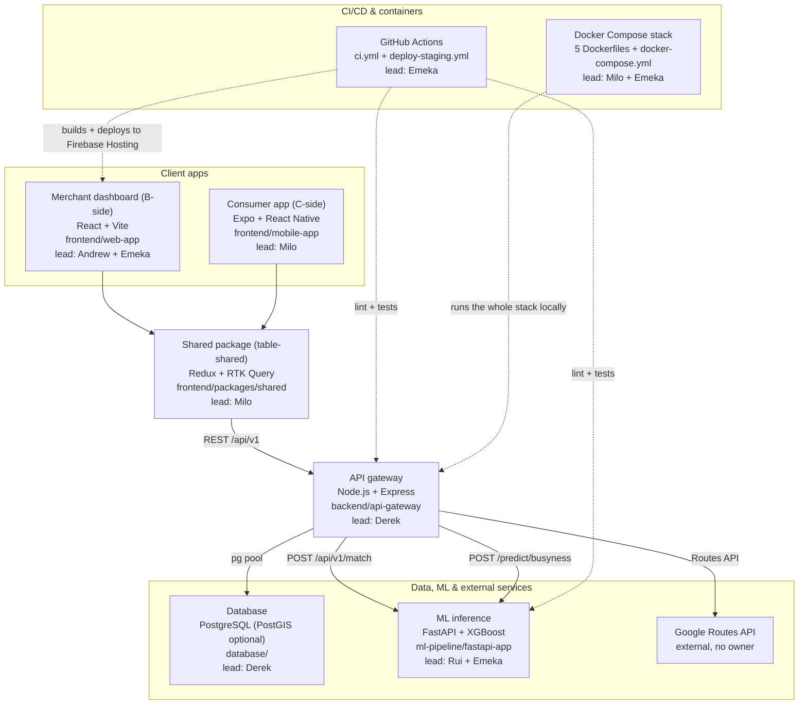
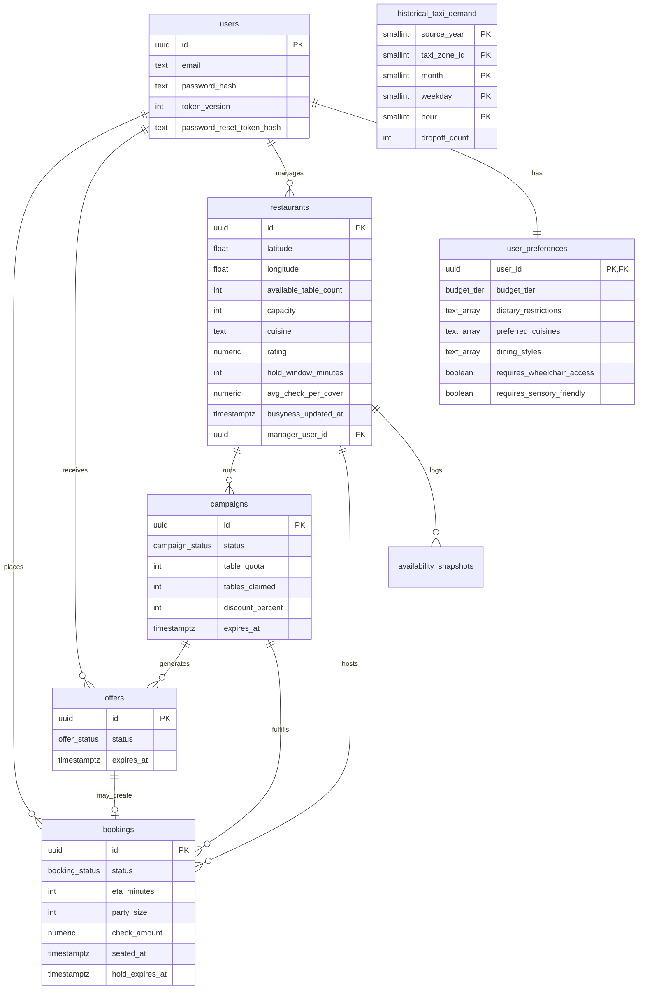

# System architecture map

**Authors:** Chukwuemeka Nwoke — Integration Lead / Scrum Master · Yang Liu — Backend Lead

Snapshot of the system on `main` as of **7 August 2026**, grouped by domain, tagged
with its lead (by commit count on that directory) and how it depends on the rest of
the system. Commit counts come from `git log --format='%an' -- <path> | sort | uniq -c`;
several members commit under more than one handle (Yang Liu = "Derek", Yuhao Xu =
"flackothegoat", Rui Xu = "TeslatotheMars", Milo = "milodenn-cs"/"milodenn-connect"),
and the counts below merge those.

## Request flow

Both clients talk to the gateway only — never to the ML service, the database, or
Google directly. The split is by audience, not by platform: the **web app is the
merchant (B-side) dashboard**, the **mobile app is the consumer (C-side) experience**.

## Backend — `backend/api-gateway/` (lead: **Derek**, 38 commits; secondary: Emeka 15, Milo 7)

Node.js/Express REST API — the hub everything else calls.

| File | Role |
|---|---|
| `src/index.js` | boots the app, calls `db/pool.js` to check connectivity |
| `src/app.js` | wires CORS, JSON parsing, `routes/health` + `routes/apiV1`, `notFound`, `errorHandler` |
| `src/config.js` | reads `.env` — `DATABASE_URL`, `ML_SERVICE_URL`, `GOOGLE_MAPS_API_KEY`, `MAPS_JS_API_KEY`, JWT, rate-limit and busyness-refresh settings |
| `src/errors.js` | `AppError` — the typed error every route throws, rendered by `errorHandler` |
| `src/db/pool.js` | Postgres connection pool → depends on **database/** schema |
| `src/routes/apiV1/index.js` | mounts `auth`, `users`, `restaurants`, `bookings`, `offers`; also serves `/status` and `/config/maps-key` (browser Maps key from the environment, kept separate from the server-side Routes key) |
| `src/routes/apiV1/{campaigns,restaurantBookings}.js` | nested under `restaurants` as `/restaurants/:restaurantId/campaigns` and `/bookings` |
| `src/routes/health.js` | health check |
| `src/routes/merchantRoutes.js` | superseded by `apiV1/restaurants.js` — not mounted anywhere |
| `src/services/{createBooking,cancelBooking,updateBookingStatus,bookingLifecycle,bookingSideEffects}.js` | booking lifecycle — create, cancel, status transitions, and the side effects each triggers |
| `src/services/{createCampaignOffers,getCampaignOffers,expireCampaigns,offerInsert,offers,candidateUsers}.js` | flash-deal campaigns and their per-user offers; `expireCampaigns` is swept lazily from the campaigns/offers/users routes rather than by a cron |
| `src/services/{getRevpash,getCampaignRevpashLift}.js` | RevPASH reporting for the merchant dashboard, over the `restaurant_revpash_hourly` view |
| `src/services/mlMatchClient.js` | calls **ML inference** (`POST {ML_SERVICE_URL}/api/v1/match`) |
| `src/services/{mlBusynessClient,busynessService}.js` | calls `POST {ML_SERVICE_URL}/predict/busyness`; `busynessService` refreshes only venues whose `busyness_updated_at` is past the TTL, de-duplicates in-flight refreshes and backs off for 5 min after a failure |
| `src/services/googleDistanceMatrix.js`, `etaResolver.js` | call **Google Routes API** (external), fall back to `utils/geo.js` haversine |
| `src/middleware/{asyncHandler,errorHandler,notFound,requireUser,requireRestaurantManager,rateLimit}.js` | cross-cutting request handling; `rateLimit` throttles auth and write endpoints |
| `src/utils/{etaCache,geo,jwt,password,passwordReset,revpash,serialize,validate,neighborhoodCentroids}.js` | shared helpers |
| `src/__tests__/*.test.js` (24 files) | Jest suite, run by `.github/workflows/ci.yml` |
| `scripts/check-openapi-drift.js` | diffs routes against `docs/architecture/openapi-v0.yaml`, enforced in CI |
| `Dockerfile`, `package.json`, `package-lock.json`, `README.md` | container + config/docs |

## Database — `database/` (lead: **Derek**, 20 commits; secondary: Milo 10, Emeka 8)

| File | Role |
|---|---|
| `migrations/001_initial_schema.sql` … `014_add_restaurant_busyness_updated_at.sql` (+ `.down.sql`) | schema, consumed by `pool.js` queries |
| `seeds/001_demo_manhattan.sql` … `006_manhattan_real_3000.sql` | demo venues, real Manhattan venues, managers, RevPASH booking history, taxi demand |
| `scripts/{migrate,seed,generate-seed,generate-restaurants-seed,enrich-places}.js` | migration/seed runners and seed generators (Google Places enrichment) |
| `scripts/{geo/ntaLookup.js,lib/restaurantPool.js,data/manhattan_nta.geojson}` | neighborhood lookup used when generating venue seeds |
| `scripts/backup-local-db.sh` | local `pg_dump` backup (recovery plan in `docs/ops/rollback-recovery-runbook.md`) |
| `Dockerfile` | one-shot migrate+seed container, run as the `migrate` service in the root `docker-compose.yml` |
| `README.md`, `package.json` | docs/config (schema doc lives at `docs/architecture/database-schema.md`) |

### Database schema

16 up-migrations as of 7 August 2026, numbered `001` → `014` (`010` and `013` each
carry two files, added in parallel). The authoritative per-column reference is
[`database-schema.md`](./database-schema.md) — this section is the shape only, kept
short so the two don't drift.

Beyond the entities above: **`availability_snapshots`** (append-only busyness
history feeding ML training), **`historical_taxi_demand`** (static weekday/hour taxi
drop-off aggregates used as ML proxy features, migration 012),
**`restaurant_revpash_hourly`** (a view, migration 007, aggregating confirmed
bookings into per-hour RevPASH for the merchant dashboard), and
**`schema_migrations`** (version tracker).

**DB-enforced behavior** (not just app code):
- `set_updated_at()` trigger on `users`/`restaurants` — auto-stamps `updated_at`
- `sync_campaign_after_booking_confirm()` trigger on `bookings` — when a
  campaign-backed booking is confirmed: increments `campaigns.tables_claimed`; if
  claimed reaches quota, flips the campaign to `completed` and bulk-revokes any
  still-pending `offers` for that campaign
- Unique partial index (migration 009) allowing **one active booking per user** —
  the lifecycle rule is enforced in the schema, not only in `bookingLifecycle.js`
- Value constraints as CHECKs: `discount_percent BETWEEN 10 AND 50`,
  `available_table_count <= capacity`, non-negative counts/ETAs, valid lat/lng
- PostGIS (migration 002) is optional and not applied by default; discovery uses
  plain lat/lng with haversine in app/SQL over a 1500 m radius

This backs `backend/api-gateway`'s services directly — `createBooking.js` /
`createCampaignOffers.js` insert into `bookings`/`offers`, `mlMatchClient.js`'s
output becomes the `user_id` list that `createCampaignOffers.js` turns into `offers`
rows, and `busynessService.js` writes `restaurants.busyness_score` /
`busyness_updated_at` back from the ML service.

## ML pipeline — `ml-pipeline/` (lead: **Rui**, 15 commits; secondary: Emeka 12, Milo 7)

| File | Role |
|---|---|
| `fastapi-app/main.py` | serves `POST /predict/busyness` (called by `mlBusynessClient.js`) and `POST /api/v1/match` (called by `mlMatchClient.js`), plus `/health` |
| `fastapi-app/model_service.py` | loads the trained pipeline and its feature tables at startup, builds the feature row per request |
| `fastapi-app/busyness_xgboost_pipeline.joblib`, `data/*.parquet` | the trained XGBoost pipeline and its restaurant/taxi feature tables — the model is a real artifact, not a heuristic |
| `fastapi-app/{area_factor,booking_maturity}.py` | area/neighborhood prior, and the blend that matures a venue's score from location prior toward its own observed bookings over its first 30 days |
| `fastapi-app/{test_main,test_model_service}.py` | pytest suite, run by `ci.yml` |
| `fastapi-app/{Dockerfile,requirements.txt,README.md}` | container/deps/docs |
| `notebooks/*.ipynb` (data engineering v1/v2, model training & evaluation, recommendation, Manhattan busyness figures) | offline model development — trains the `.joblib` above, not imported at runtime |
| `notebooks/*.csv`, `*.xlsx` | training/reference datasets used by the notebooks above |

## Frontend shared — `frontend/packages/shared/` (lead: **Milo**, 19 commits; secondary: Derek 9, Andrew 8)

| File | Role |
|---|---|
| `src/apiSlice.ts` | RTK Query client → calls **API gateway** `/api/v1/*`; ~30 endpoints covering auth, profile/preferences, discovery, ETA, bookings, offers, campaigns, RevPASH and password reset |
| `src/{authSlice,userSlice,settingsSlice}.ts` | Redux slices, consumed by both apps |
| `src/constants.ts` | product constants kept in sync with the API contract — discovery radius (1500 m), seat-availability poll interval, cuisine list |
| `src/restaurantFilters.ts` | shared filtering/labelling (busyness colour + label, cuisine/preference filters) used by both clients |
| `src/{store,hooks,types,index}.ts` | store setup, typed hooks, shared types, barrel export |

Consumed differently by the two apps: `web-app` imports by **relative path**
(`../../packages/shared/src/...`), `mobile-app` via the **`@shared/*` path alias**
declared in its `tsconfig.json`. It is an npm workspace, but not a built package —
both apps compile its TypeScript source directly.

## Frontend web (merchant dashboard) — `frontend/web-app/` (lead: **Andrew**, 18 commits; **Emeka**, 18; secondary: Milo 9, Yuhao 8)

B-side only — the consumer journey moved to the mobile app.

| File | Role |
|---|---|
| `src/main.jsx`, `app.jsx`, `store.js` | entry point, React Router routes, wires `table-shared`'s `apiSlice` |
| `src/context/{AuthContext,ThemeContext}.jsx` | auth state (backed by `authSlice`) and light/dark theming |
| `src/views/{LoginView,RegisterView,RestaurantSetupView,ForgotPasswordView,ResetPasswordView}.jsx` | merchant sign-up, sign-in and password-reset screens |
| `src/views/merchant/{MerchantLayout,OverviewView,SettingsView}.jsx` | the dashboard itself — nested routes under `/merchant` |
| `src/components/*` (11 files: `OccupancyMeter`, `BusynessMeter`, `RevpashMeter`, `LiveOfferTracker`, `CampaignHistory`, `BookingsList`, `RestaurantLocationPicker`, `AccessibilityPanel`, `PasswordInput`, `UserBadge`, `BrandMark`) | dashboard UI |
| `src/utils/validation.js` | form validation shared across the auth views |
| `src/{components,views,utils}/__tests__/*`, `src/test/setup.js` | Vitest suite |
| `Dockerfile`, `nginx.conf` | production image — Vite build served by nginx |
| `vite.config.js`, `tailwind.config.js`, `postcss.config.js`, `.eslintrc.cjs`, `index.html`, `src/index.css` | build/config |

## Frontend mobile (consumer app) — `frontend/mobile-app/` (lead: **Milo**, 64 commits)

| File | Role |
|---|---|
| `src/app/{_layout,index,onboarding,+not-found}.tsx` | Expo Router root — providers, entry redirect, onboarding flow |
| `src/app/tabs/{DiscoverTab,MapTab,CardTab,InboxTab,ProfileTab}.tsx` + `_layout.tsx` | the five tabs; `MapTab` has `.native.tsx`/`.web.tsx` variants so Expo web and device builds each get a working map |
| `src/components/*` (23 files: `RestaurantCard`, `BookingCard`, `OfferCard`, `SearchBar`, `FilterBar`, `PreferenceFilters`, `DraggableSheet`, `ModalSheet`, `WebMap`, `ManhattanAreaPicker`, `BookingCheckout`, `OfferCheckout`, etc.) | UI components, several with `.web.tsx` variants |
| `src/lib/{mapDisplay,cuisineImages,directions,format}.ts` | display logic — desirability ranking for map markers and Discover, cuisine imagery, directions, formatting |
| `src/context/ProfileContext.tsx` | local profile state, layered on top of `table-shared` |
| `src/theme.ts`, `global.css` | NativeWind theming |
| `src/services/pushNotifications.ts` | Expo push notifications (see `push-notifications.md`) |
| `metro.config.js` | bundler config **plus a dev-only `/api/*` → gateway proxy**: Expo's tunnel carries the bundle only, so proxying here puts the API on the same origin as the bundle and a phone on mobile data can still reach the gateway (mirrors the web app's Vite `server.proxy`) |
| `Dockerfile`, `app.config.js`, `app.json`, `eas.json`, `babel.config.js`, `tailwind.config.js`, `tsconfig.json`, `eslint.config.js` | container + build/config |
| `assets/**` (icons, splash, tab icons) | static assets, no dependencies |

Changes driven by the usability round are tracked per-section in
[`docs/user-testing/user-testing-fixes-strategy.md`](../user-testing/user-testing-fixes-strategy.md).

## Containers, CI/CD & docs (lead: **Emeka** on CI, **Milo** on Docker, **Derek** on docs)

| File | Role |
|---|---|
| `docker-compose.yml` (root) | the full local stack: `postgres`, one-shot `migrate`, `ml-service`, `api-gateway`, `web`, `mobile` (profile-gated, ngrok tunnel), `pgadmin` — driven by the `npm run docker:*` scripts |
| 5 × `Dockerfile` (`backend/api-gateway`, `ml-pipeline/fastapi-app`, `database`, `frontend/web-app`, `frontend/mobile-app`) | one image per service |
| `.github/workflows/ci.yml` | 5 jobs — OpenAPI lint (Redocly), web lint/test/build, mobile lint, gateway `check:openapi-drift` + Jest, ML pipeline pytest |
| `.github/workflows/deploy-staging.yml` | on `develop`: build web + verify backend installs, then deploy the web build to **Firebase Hosting** |
| `cloud_deployments/` | Terraform per provider; nothing currently live — GCP was decommissioned 2026-08-01, AWS/Azure are unapplied designs (see its `README.md`) |
| `docs/architecture/openapi-v0.yaml` | contract source of truth for `api-gateway` + `table-shared`, enforced by `check-openapi-drift.js` |
| `docs/architecture/postman/table-integration-journeys.postman_collection.json` | Postman smoke journeys (C-side + B-side) |
| `docs/{architecture,ops,design,product,user-testing,sprints,budget-timesheets,academic}/*` | planning, reference and assessment docs, no runtime dependency — index in [`docs/README.md`](../README.md) |
| root `package.json` | npm workspaces list tying the 5 packages together, plus the `docker:*` / `dev:*` scripts; `redocly.yaml` lints the OpenAPI spec |
