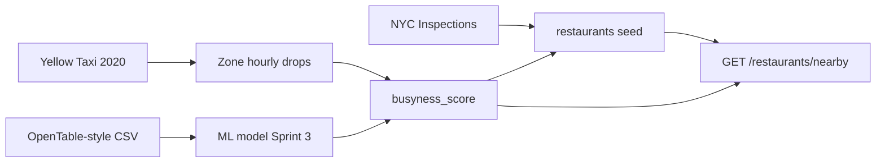

# Tablé Data Strategy (BE-5)

**Status:** Sprint 1 · **Owners:** Backend Lead + Data & ML Lead  
**Related:** [ADR-001](./adr/ADR-001.md) · [database/schema.md](../database/schema.md) · [api-contract-v0.md](./api-contract-v0.md)

---

## 1. Purpose

This document satisfies COMP47360 Sprint 1 requirements to:

1. Select **≥2 Manhattan-relevant open datasets**
2. Define how **busyness** and **table availability** are represented in the MVP
3. Record **data quality** risks and mitigations
4. Explain how **simulated “live”** updates replace production restaurant APIs (per business plan risk #2)

Tablé does **not** use paid OpenTable Partner APIs or Google Places as primary sources in MVP.

---

## 2. Busyness and availability definitions

### 2.1 Terms

| Term | Meaning in Tablé | Stored where |
|------|------------------|--------------|
| **Busyness** | How crowded a venue or area is (0 = quiet, 1 = very busy) | `restaurants.busyness_score`, `availability_snapshots.busyness_score` |
| **Available tables** | Integer count of tables the platform will offer for immediate booking **right now** | `restaurants.available_table_count` |
| **Live availability** | Value shown on the map at query time | Denormalized on `restaurants`; history in `availability_snapshots` |

### 2.2 Primary MVP metric (product / P0 stories)

**Discovery filter (Story 2.1):** show restaurant only if  

`available_table_count > 0` **and** distance ≤ **1500 m**.

**Map / ML feature (analytics):** `busyness_score ∈ [0, 1]`.

### 2.3 How we derive values (MVP — simulated)

Production reservation feeds are unavailable. MVP uses a **two-layer model**:

```text
Historical signals (datasets below)
        ↓
  ML / heuristic busyness_score (by restaurant, hour, DOW)
        ↓
  Simulation rule → available_table_count
        ↓
  Optional: cron or manual script updates Postgres + snapshots
```

**Simulation rule (v0 — interpretable, Sprint 2 default):**

```text
base_tables = seed constant per restaurant (e.g. 4–12)
hour_factor = f(busyness_score)   # e.g. round(base_tables * (1 - busyness_score))
available_table_count = max(0, hour_factor - active_bookings)
```

- `active_bookings` = count of `bookings` with status `pending` or `confirmed` for that restaurant.
- Demo script can bump counts every N minutes to mimic “lulls” for flash deals.

**ML enhancement (Sprint 3):** Data & ML replaces `f()` with a trained regressor/classifier using features in §5.

---

## 3. Dataset inventory (≥2 primary + 1 optional)

### Dataset A — NYC restaurant locations & metadata (primary)

| Field | Value |
|-------|--------|
| **Name** | DOHMH New York City Restaurant Inspection Results |
| **Portal** | [NYC Open Data](https://opendata.cityofnewyork.us/) |
| **Dataset page** | https://data.cityofnewyork.us/Health/DOHMH-New-York-City-Restaurant-Inspection-Results/43nn-8n43j |
| **License** | NYC Open Data Terms of Use (free, public) |
| **Update** | Periodic inspections (not real-time occupancy) |
| **Manhattan use** | Filter `BORO` = `Manhattan` (or borough code `1`) |

**Key columns (expected):**

| Column | Use in Tablé |
|--------|----------------|
| `CAMIS` | Stable external restaurant id → seed `restaurants.id` mapping table |
| `DBA` / `NAME` | `restaurants.name` |
| `BUILDING`, `STREET`, `ZIPCODE`, `BORO` | Address / `neighborhood` |
| `LATITUDE`, `LONGITUDE` | Discovery haversine (when present) |
| `CUISINE DESCRIPTION` | ML features, UI tags |
| `INSPECTION DATE` | Not occupancy — metadata only |

**Role:** Authoritative **restaurant dimension** for Manhattan POIs in Postgres seed (BE-9).

---

### Dataset B — NYC Yellow Taxi trips 2020 (primary — busyness proxy)

| Field | Value |
|-------|--------|
| **Name** | 2020 Yellow Taxi Trip Data |
| **Portal** | https://data.cityofnewyork.us/Transportation/2020-Yellow-Taxi-Trip-Data/kxp8-n2sj |
| **License** | NYC Open Data (free) |
| **Grain** | One row per trip; pickup/dropoff datetime and coordinates |
| **Manhattan use** | Filter `PULocationID` / `DOLocationID` in Manhattan zone IDs (TLC taxi zone lookup table, also on NYC Open Data) |

**Key columns:**

| Column | Use in Tablé |
|--------|----------------|
| `tpep_pickup_datetime` | Time bucket (hour, DOW) |
| `DOLocationID` / dropoff lat-lng if derived | Spatial aggregation near restaurant |
| `trip_distance`, `fare_amount` | Optional features |

**Role:** Proxy for **area busyness** — aggregate dropoff counts per taxi zone per hour → normalize to `busyness_score` for restaurants in that zone.

**Join to restaurants:**  
Restaurant `(lat, lng)` → taxi zone polygon (spatial join or nearest zone centroid) → hourly dropoff counts.

---

### Dataset C — OpenTable-style reservation patterns (optional / ML training)

| Field | Value |
|-------|--------|
| **Name** | Public research or competition datasets with **reservation time / party size / restaurant id** (no live API) |
| **Examples** | Team may use cleaned CSV from course workshops, Kaggle “restaurant reservation” sets, or synthetic OpenTable-shaped samples |
| **License** | Must be free for academic use; **no paid OpenTable API** |

**Role:** Train **time-series / peak-hour** models (party size, lead time, cancellation patterns) aligned with business plan §3. Feeds FastAPI busyness forecast, not live inventory.

**Status:** Exploratory in Sprint 1; EDA owner = Data & ML. Backend consumes **output scores** only.

---

### Supplementary (Sprint 2+, not counted as primary)

| Source | Use |
|--------|-----|
| [OSM Overpass](https://overpass-turbo.eu/) / Geofabrik NYC extract | Extra POIs, cuisine tags if inspection data thin |
| TLC Taxi Zone shapefile | Zone polygons for taxi join |
| Internal `availability_snapshots` | Ground truth for “what we showed users” after simulation |

---

## 4. Join and pipeline strategy



### 4.1 Manhattan boundary

- Restaurants: `BORO = Manhattan` from Dataset A, or lat/lng bounding box (~40.70–40.88, -74.02–-73.91) for seed consistency with demo map.

### 4.2 Identifier strategy

| Layer | ID |
|-------|-----|
| External | `CAMIS` (inspections), TLC `LocationID` (taxi) |
| Internal | `restaurants.id` UUID (BE-2) |
| Mapping | `restaurant_external_ids` table optional in Sprint 2; or CSV column in seed file |

### 4.3 ETL phases

| Phase | Sprint | Output |
|-------|--------|--------|
| **P1 Sample** | 1 | Download ≤50k taxi rows + Manhattan inspections subset; notebook/CSV proof |
| **P2 Seed** | 2 | `database/seeds/restaurants.sql` from inspections |
| **P3 Aggregates** | 2 | Hourly zone busyness parquet/CSV |
| **P4 Simulator** | 2–3 | Node or Python job writes `available_table_count` + `availability_snapshots` |
| **P5 ML** | 3 | FastAPI serves `busyness_score` override |

---

## 5. Feature list for ML (BE-7 / FastAPI)

| Feature | Source |
|---------|--------|
| `hour_of_day`, `day_of_week` | Taxi aggregates, reservation CSV |
| `taxi_dropoffs_1h` | Dataset B |
| `rolling_busyness_7d` | `availability_snapshots` |
| `neighborhood` | Dataset A |
| `cuisine` | Dataset A |
| `user.budget_tier`, `dietary_tags` | `users` (Story 1.1) |
| `distance_meters` | Computed at match time |

**Target (Sprint 3 options):**

- Regression: `busyness_score`
- Classification: `available_table_count > 0`
- Ranking: click/accept probability for flash deal match

---

## 6. Data quality issues and mitigations

| Issue | Impact | Mitigation |
|-------|--------|------------|
| Missing `LATITUDE`/`LONGITUDE` in inspections | Cannot place on map | Geocode from address (one-time); or drop row; OSM fallback |
| Inspection data ≠ live occupancy | Misleading if labeled “real-time” | UI copy: “predicted / simulated”; use taxi + model, not inspection grade |
| Taxi 2020 only (COVID bias) | Skews busyness vs 2026 demo | Document in paper; use relative hour-of-week patterns; optional downsample |
| Large taxi files | Local EDA slow | Use 1–3 month sample; Parquet; aggregate before join |
| Duplicate `CAMIS` / name changes | Duplicate restaurants | Dedupe by `CAMIS`, keep latest inspection |
| Zone ↔ restaurant spatial error | Wrong busyness | Nearest zone; validate with map spot check |
| No OpenTable live API | No true `available_table_count` | **Simulation rule** (§2.3); bookings decrement count in app |

---

## 7. Mapping to PostgreSQL (BE-2)

| Table / column | Populated from |
|----------------|----------------|
| `restaurants` | Dataset A seed (+ manual demo tweaks) |
| `restaurants.busyness_score` | Dataset B aggregates + ML (Sprint 3) |
| `restaurants.available_table_count` | Simulation job − active bookings |
| `availability_snapshots` | Append each simulation tick or hourly cron |
| `users.dietary_tags`, `budget_tier` | App onboarding only |
| `bookings` | Runtime API (reduces availability) |
| `campaigns` / `offers` | B-side + ML match (not from open data) |

---

## 8. Verification checklist (Sprint 1 — BE-5 done when)

- [x] ≥2 named open datasets with URLs and Manhattan filter
- [x] Busyness vs `available_table_count` defined
- [x] Simulation approach documented (no live OpenTable API)
- [x] Quality risks + mitigations listed
- [x] Join path to `restaurants` and ML features
- [ ] Data & ML sign-off (comment in Jira / PR)
- [x] Demo seed for development — `database/seeds/` (BE-9)
- [ ] Optional: 1-page EDA notebook link in `ml-pipeline/notebooks/` (Sprint 2)

---

## 9. Sprint 2 action items

| Owner | Task |
|-------|------|
| Data & ML | Sample download + EDA notebook; taxi zone aggregation |
| Backend | BE-9 demo seed (`database/seeds/`); later expand from inspections CSV |
| Backend | Simulator script updating `available_table_count` |
| Backend | Wire `busyness_score` into `GET /restaurants/nearby` response |
| Product | Paper wording: “simulated availability from open data” |

---

## 10. Cost and compliance

| Item | MVP stance |
|------|------------|
| Paid datasets | **Not used** |
| Google Places | **Not** primary inventory (ADR-001-E) |
| Google Distance Matrix | ETA only (BE-3), not busyness |
| Storage | Local Postgres + files; Cloud SQL optional Sprint 5 |

---

## Changelog

| Version | Date | Notes |
|---------|------|-------|
| v0 | 2026-06-02 | Initial BE-5 strategy |
