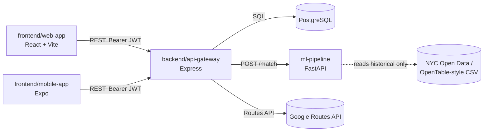

# Tablé Integration Strategy

**Status:** Sprint 4 · **Owners:** Scrum Master + Backend Lead
**Related:** [ADR-001](./adr/ADR-001.md) · [api-contract-v0.md](./api-contract-v0.md) · [openapi-v0.yaml](./openapi-v0.yaml) · [data-strategy.md](./data-strategy.md) · [frontend-strategy.md](./frontend-strategy.md) · [deployment-guide.md](./deployment-guide.md)

---

## 1. Purpose

This document defines **how the four workspaces integrate with each other and with external services**, so that web, mobile, the API gateway, and the ML pipeline stay contract-compatible as they're built in parallel by separate owners. It covers:

1. Internal integration — which workspace calls which, and over what contract
2. External integration — third-party APIs, what they're used for, and fallback if unavailable
3. The integration environment (`integrate` branch) and what must be true before code lands there
4. Contract change process — how a breaking API change gets communicated without breaking another lead's in-flight work
5. Failure isolation — what happens to the rest of the system when one dependency is down

Tablé is a **monolith-first MVP** (ADR-001-B): there is no service mesh to integrate. The integration problem here is mostly **contract discipline between independently-developed clients (web, mobile) and one gateway**, plus **one external API call (ETA) and one internal-but-separate service (ML)**.

---

## 2. Internal integration map

| Integration | Protocol | Contract source of truth | Direction |
|---|---|---|---|
| Web ↔ Gateway | REST, JSON, `Authorization: Bearer <jwt>` (preferred) or interim `X-User-Id` | [api-contract-v0.md](./api-contract-v0.md), [openapi-v0.yaml](./openapi-v0.yaml) | Bidirectional, gateway is authoritative |
| Mobile ↔ Gateway | REST, JSON, `Authorization: Bearer <jwt>` (preferred) or interim `X-User-Id` | Same as above | Bidirectional, gateway is authoritative |
| Gateway ↔ PostgreSQL | SQL (`pg` / migrations) | [database/schema.md](../database/schema.md) | Gateway is authoritative; DB has no business logic beyond constraints/triggers |
| Gateway ↔ ML pipeline | REST, `POST /match` (internal) | api-contract-v0.md §5 | Gateway calls ML; ML never calls gateway or writes to Postgres directly |
| Gateway ↔ Google Routes API | REST, external (`computeRouteMatrix`) | ADR-001-F | Gateway calls Google; gateway is authoritative for `canBook`, not the client |

**Rule:** clients (web, mobile) never call the ML pipeline or Google Routes API directly. The gateway is the single integration point for everything outside the browser/app — this keeps API keys server-side and means there is exactly one contract (api-contract-v0.md) for both frontend leads to build against, instead of two.

---

## 3. External integrations

| Service | Used for | Status | Owner | Fallback if unavailable |
|---|---|---|---|---|
| **Google Routes API** (`computeRouteMatrix`) | ETA guardrail (`GET /api/v1/restaurants/:id/eta`) | Accepted (ADR-001-F) | Backend Lead | Haversine estimate in gateway; cache ETA ~5 min either way to bound cost |
| **NYC Open Data** (inspections, taxi trips) | Restaurant seed + busyness proxy | Accepted (data-strategy.md) | Data & ML Lead | N/A — offline batch download, not a runtime dependency |
| **Expo push / `expo-notifications`** | Mobile push for flash deals | Proposed, post-MVP (ADR-001-G) | Mobile Lead | REST inbox polling (MVP default) — push is additive, not load-bearing |
| **Firebase** | Push delivery infra if Expo push insufficient | Deferred (Phase 2) | Mobile Lead | Same as above |

**Explicitly out of scope for integration in MVP** (ADR-001-E): OpenTable Partner API, Google Places as primary discovery source, generative AI / Dining Copilot (ADR-001-H withdrawn). These are not wired into any environment and should not appear in `.env.example` files as required keys.

**Cost control:** the only paid/metered external call in the MVP critical path is Google Routes API. It is called once per restaurant-detail view and cached ~5 minutes server-side — this is an integration constraint, not just a cost optimization, because it bounds how often the gateway needs network access to a third party to answer a request that's otherwise fully local (Postgres + ML).

---

## 4. Contract-first workflow

Three teams (web, mobile, ML) build against one gateway that a fourth (backend) is implementing concurrently. To avoid the two frontend leads blocking on backend implementation order:

1. **api-contract-v0.md + openapi-v0.yaml are the source of truth**, not the running server. A route documented there can be mocked by web/mobile before the gateway implements it.
2. **OpenAPI lint runs in CI** (`Lint OpenAPI contract` check, see [deployment-guide.md](./deployment-guide.md)) — the spec must stay valid and in sync with the documented contract on every PR into `integrate`.
3. **Breaking changes to a shipped route** (field rename, status code change, new required field) require:
   - An update to `openapi-v0.yaml` and `api-contract-v0.md` in the same PR as the code change
   - A note in the PR description tagging the affected client owner(s)
   - No silent field renames — additive fields are non-breaking and don't need this process
4. **Auth:** JWT (`Authorization: Bearer`) is the primary client auth mechanism. The interim `X-User-Id` header remains supported for dev/demo and legacy tests until all clients migrate. Do not build parallel mock auth schemes — use the documented contract so integration testing is real.

---

## 5. The `integrate` branch as the integration environment

Per [deployment-guide.md](./deployment-guide.md), `integrate` is where independently-built `feature/*` branches first run against each other. For this document's purposes, that means:

- A PR into `integrate` should be tested against the **current contract**, not just unit-tested in isolation — e.g. a gateway change to `/restaurants/nearby` should be checked against what the web/mobile mocks currently expect.
- CI on `integrate` runs all five checks (OpenAPI lint, web build, mobile lint, gateway tests, ML import check) — this is the first point where a contract mismatch between two workspaces would actually be caught mechanically, since each workspace's CI job only validates that workspace internally.
- `integrate` has no branch protection yet (single merger), so contract discipline here is currently **process, not enforced gate**. If/when a second regular merger joins, add a required check that diffs `openapi-v0.yaml` against the previous commit and flags removed/renamed fields for explicit review.

---

## 6. Failure isolation

| If this is down/slow | Effect on rest of system | Mitigation |
|---|---|---|
| Google Routes API | `canBook` / ETA endpoint fails | Haversine estimate fallback (ADR-001-F); booking flow degrades to estimate-based ETA, not a hard outage |
| ML pipeline (FastAPI) | New flash-deal matches stop generating | Gateway falls back to heuristic/random match (ADR-001-C, Sprint 2 default) rather than blocking the offers flow |
| PostgreSQL | Full outage — gateway has no fallback store | Out of scope for MVP; acceptable given single-instance local/Cloud SQL deployment |
| Web or mobile client | No effect on gateway, ML, or the other client | Confirms the contract-first split is doing its job — clients are integration leaves, not hubs |

---

## 7. Historical note: July 2026 merge batch

> **Archival:** §7.1–7.3 below describe a one-time July 2026 backlog when `integrate` had diverged from `main`. That batch is complete — `integrate` is now the active integration branch where feature PRs land before promotion to `develop` / `main`. Keep §7 for history only; do not treat the branch table as current work.

### 7.1 What's actually pending

| Branch | Area | Commits | Files touched |
|---|---|---|---|
| `feature/ui-style-guide-tokens` | Frontend (web) | 1 | `tailwind.config.js`, `vite.config.js`, `app.jsx`, `index.css`, new `docs/ui-style-guide.md` |
| `feature/unit-tests-ci-coverage` | Backend + Frontend (web) + ML, CI | 2 | New Jest/Vitest specs, `.github/workflows/ci.yml`, `vite.config.js`, package.json/lockfiles |
| `feature/frontend-integration` | Frontend (web) ↔ Backend | 3 | 22 files — merchant dashboard, `AuthContext`, `apiSlice`, onboarding/map services, `tailwind.config.js`, `vite.config.js`, `app.jsx` |
| `TeslatotheMars-patch-2` | ML | 1 | 18 files, all `ml-pipeline/notebooks/*` (recommendation algorithm + data) |

Mobile has **no pending branch** — its recent work (auth slice, offer cards, inbox tab, redux location state, ETA routing) already merged straight to `main`. That's the same integrate-skipping pattern called out above, not new work waiting to land.

**Conflict surface:** `tailwind.config.js`, `vite.config.js`, and `app.jsx` are each touched by two or three of the frontend-area branches. `TeslatotheMars-patch-2` is fully isolated (ML notebooks only) — no conflicts expected.

### 7.2 Merge order into `integrate`

1. **Sync `integrate` with `origin/main`** (merge, not rebase — preserves `integrate`'s own commits). Must happen first, or every branch below replays those 61 unrelated commits into `integrate` as noise.
2. **`feature/ui-style-guide-tokens`** — smallest, most foundational (styling tokens), merges cleanest first.
3. **`feature/unit-tests-ci-coverage`** — resolve `vite.config.js` against step 2.
4. **`feature/frontend-integration`** — largest; resolve `tailwind.config.js` / `vite.config.js` / `app.jsx` against steps 2–3. Frontend Lead should be on hand for this merge specifically, since they own the intent behind both overlapping changes.
5. **`TeslatotheMars-patch-2`** — isolated, merge last, no conflicts expected.
6. Run all five CI checks on `integrate` (openapi-lint, web, mobile, backend, ml-pipeline) before treating the batch as done.

### 7.3 When to promote `integrate` → `develop` → `main`

Per §5 and [deployment-guide.md](./deployment-guide.md), promotion is a deliberate step, not automatic per-merge:

- Promote **`integrate` → `develop`** only after all four branches above are merged into `integrate` *and* CI is green on the resulting `integrate` HEAD — a partial batch (e.g. tokens + tests but not frontend-integration) is not a promotion trigger.
- `develop` currently lacks `ci.yml`/`deploy-staging.yml` versions newer than its last sync — confirm those land as part of this promotion, not assumed present.
- Promote **`develop` → `main`** only after the staging deploy (triggered automatically by the `develop` push) has been sanity-checked — there's no automated production deploy yet (§4 of deployment-guide.md), so this is still a manual, reviewed step.
- Going forward: route mobile PRs through `integrate` too, rather than straight to `main` — the point of this flow is that nothing skips integration testing, and mobile has been the one exception in practice.

---

## 8. Sprint 4 action items

| Owner | Task |
|---|---|
| Backend Lead | Implement `PATCH /bookings/:id/status`, `GET /restaurants/:id/revpash`, `GET /campaigns/:campaignId/offers` (frontend already wired) |
| Backend Lead | Implement `POST /bookings/:id/cancel` (Story 4.2) |
| Web Lead | Remove stale "Needs backend" comments in `apiSlice.ts` as routes ship; keep UI fallbacks until RevPASH/offers endpoints exist |
| Scrum Master | Keep Postman collection (`docs/postman/`) in sync with shipped routes for staging smoke tests |
| All leads | Route PRs through `integrate`; run five CI checks before promotion |

---

## Changelog

| Version | Date | Notes |
|---------|------|-------|
| v0 | 2026-06-24 | Initial integration strategy |
| v1 | 2026-07-03 | Added §7 current integration plan: pending branch inventory, conflict surface, merge order into `integrate`, and promotion timing for `integrate` → `develop` → `main` |
| v2 | 2026-07-12 | JWT primary auth; React+Vite web stack; Google Routes API; mark §7 as archival; refresh Sprint 4 action items |
