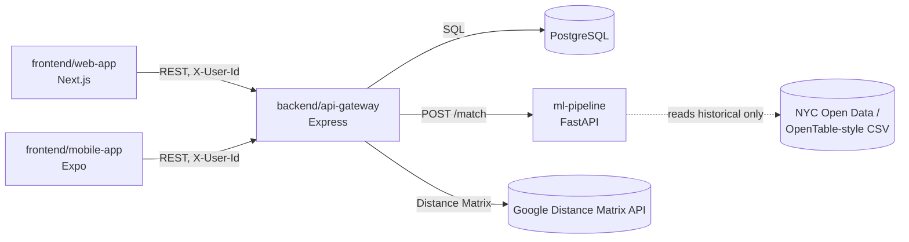

# Tablé Integration Strategy

**Status:** Sprint 1–2 · **Owners:** Scrum Master + Backend Lead
**Related:** [ADR-001](./adr/ADR-001.md) · [api-contract-v0.md](./api-contract-v0.md) · [openapi-v0.yaml](./openapi-v0.yaml) · [data-strategy.md](./data-strategy.md) · [frontend-strategy.md](./frontend-strategy.md) · [deployment-guide.md](./deployment-guide.md)

---

## 1. Purpose

This document defines **how the four workspaces integrate with each other and with external services**, so that web, mobile, the API gateway, and the ML pipeline stay contract-compatible as they're built in parallel by separate owners. It covers:

1. Internal integration — which workspace calls which, and over what contract
2. External integration — third-party APIs, what they're used for, and fallback if unavailable
3. The integration environment (`integrate` branch) and what must be true before code lands there
4. Contract change process — how a breaking API change gets communicated without breaking another lead's in-flight work
5. Failure isolation — what happens to the rest of the system when one dependency is down

Tablé is a **monolith-first MVP** (ADR-001-B): there is no service mesh to integrate. The integration problem here is mostly **contract discipline between independently-developed clients (web, mobile) and one gateway**, plus **one external API call (ETA) and one internal-but-separate service (ML)**.

---

## 2. Internal integration map

| Integration | Protocol | Contract source of truth | Direction |
|---|---|---|---|
| Web ↔ Gateway | REST, JSON, `X-User-Id` header | [api-contract-v0.md](./api-contract-v0.md), [openapi-v0.yaml](./openapi-v0.yaml) | Bidirectional, gateway is authoritative |
| Mobile ↔ Gateway | REST, JSON, `X-User-Id` header | Same as above | Bidirectional, gateway is authoritative |
| Gateway ↔ PostgreSQL | SQL (`pg` / migrations) | [database/schema.md](../database/schema.md) | Gateway is authoritative; DB has no business logic beyond constraints/triggers |
| Gateway ↔ ML pipeline | REST, `POST /match` (internal) | api-contract-v0.md §5 | Gateway calls ML; ML never calls gateway or writes to Postgres directly |
| Gateway ↔ Google Distance Matrix | REST, external | ADR-001-F | Gateway calls Google; gateway is authoritative for `canBook`, not the client |

**Rule:** clients (web, mobile) never call the ML pipeline or Google Distance Matrix directly. The gateway is the single integration point for everything outside the browser/app — this keeps API keys server-side and means there is exactly one contract (api-contract-v0.md) for both frontend leads to build against, instead of two.

---

## 3. External integrations

| Service | Used for | Status | Owner | Fallback if unavailable |
|---|---|---|---|---|
| **Google Distance Matrix API** | ETA guardrail (`GET /api/v1/restaurants/:id/eta`) | Accepted, Sprint 2 (ADR-001-F) | Backend Lead | OSRM / open routing engine; cache ETA ~5 min either way to bound cost |
| **NYC Open Data** (inspections, taxi trips) | Restaurant seed + busyness proxy | Accepted (data-strategy.md) | Data & ML Lead | N/A — offline batch download, not a runtime dependency |
| **OpenAI (or equivalent)** | Dining Copilot conversational UX | Proposed, Sprint 4 (ADR-001-H) | Data & ML Lead | Feature flagged off; core booking flow does not depend on it |
| **Expo push / `expo-notifications`** | Mobile push for flash deals | Proposed, post-MVP (ADR-001-G) | Mobile Lead | REST inbox polling (MVP default) — push is additive, not load-bearing |
| **Firebase** | Push delivery infra if Expo push insufficient | Deferred (Phase 2) | Mobile Lead | Same as above |

**Explicitly out of scope for integration in MVP** (ADR-001-E): OpenTable Partner API, Google Places as primary discovery source. These are not wired into any environment and should not appear in `.env.example` files as required keys.

**Cost control:** the only paid/metered external call in the MVP critical path is Google Distance Matrix. It is called once per restaurant-detail view and cached ~5 minutes server-side — this is an integration constraint, not just a cost optimization, because it bounds how often the gateway needs network access to a third party to answer a request that's otherwise fully local (Postgres + ML).

---

## 4. Contract-first workflow

Three teams (web, mobile, ML) build against one gateway that a fourth (backend) is implementing concurrently. To avoid the two frontend leads blocking on backend implementation order:

1. **api-contract-v0.md + openapi-v0.yaml are the source of truth**, not the running server. A route documented there can be mocked by web/mobile before the gateway implements it.
2. **OpenAPI lint runs in CI** (`Lint OpenAPI contract` check, see [deployment-guide.md](./deployment-guide.md)) — the spec must stay valid and in sync with the documented contract on every PR into `integrate`.
3. **Breaking changes to a shipped route** (field rename, status code change, new required field) require:
   - An update to `openapi-v0.yaml` and `api-contract-v0.md` in the same PR as the code change
   - A note in the PR description tagging the affected client owner(s)
   - No silent field renames — additive fields are non-breaking and don't need this process
4. **Auth stub (`X-User-Id`)** is intentionally primitive (ADR-001-A/I) so both clients can integrate against real endpoints in Sprint 1–2 without building OAuth first. Do not let either client build a parallel mock auth scheme — use the stub header so contract testing is real, not simulated twice.

---

## 5. The `integrate` branch as the integration environment

Per [deployment-guide.md](./deployment-guide.md), `integrate` is where independently-built `feature/*` branches first run against each other. For this document's purposes, that means:

- A PR into `integrate` should be tested against the **current contract**, not just unit-tested in isolation — e.g. a gateway change to `/restaurants/nearby` should be checked against what the web/mobile mocks currently expect.
- CI on `integrate` runs all five checks (OpenAPI lint, web build, mobile lint, gateway tests, ML import check) — this is the first point where a contract mismatch between two workspaces would actually be caught mechanically, since each workspace's CI job only validates that workspace internally.
- `integrate` has no branch protection yet (single merger), so contract discipline here is currently **process, not enforced gate**. If/when a second regular merger joins, add a required check that diffs `openapi-v0.yaml` against the previous commit and flags removed/renamed fields for explicit review.

---

## 6. Failure isolation

| If this is down/slow | Effect on rest of system | Mitigation |
|---|---|---|
| Google Distance Matrix | `canBook` / ETA endpoint fails | OSRM fallback (ADR-001-F); booking flow degrades to "ETA unavailable," not a hard outage |
| ML pipeline (FastAPI) | New flash-deal matches stop generating | Gateway falls back to heuristic/random match (ADR-001-C, Sprint 2 default) rather than blocking the offers flow |
| PostgreSQL | Full outage — gateway has no fallback store | Out of scope for MVP; acceptable given single-instance local/Cloud SQL deployment |
| Web or mobile client | No effect on gateway, ML, or the other client | Confirms the contract-first split is doing its job — clients are integration leaves, not hubs |

---

## 7. Sprint 2–3 action items

| Owner | Task |
|---|---|
| Backend Lead | Implement `GET /restaurants/:id/eta` with Google Distance Matrix + 5-min cache; document OSRM fallback trigger condition |
| Backend Lead | Implement `POST /match` proxy to ML pipeline with heuristic fallback when FastAPI unavailable |
| Data & ML Lead | Confirm `POST /match` request/response shape matches api-contract-v0.md §5 before Sprint 3 model swap |
| Scrum Master | Add OpenAPI diff check to `integrate` CI once a second regular merger is active |
| Web + Mobile Leads | Confirm both clients consume `X-User-Id` stub the same way; no parallel mock auth |

---

## Changelog

| Version | Date | Notes |
|---------|------|-------|
| v0 | 2026-06-24 | Initial integration strategy |
