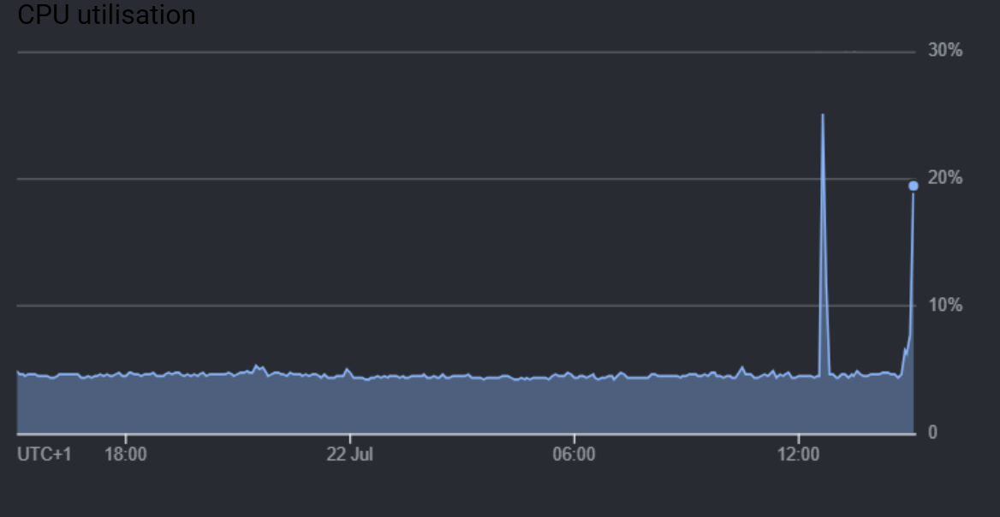
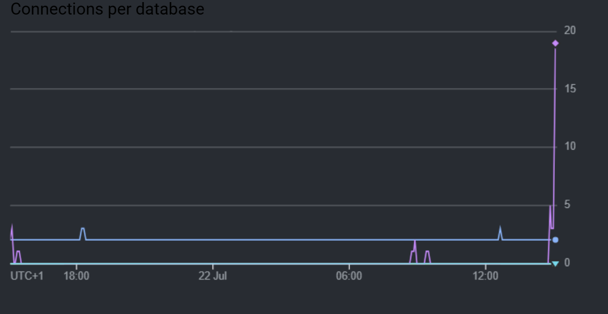
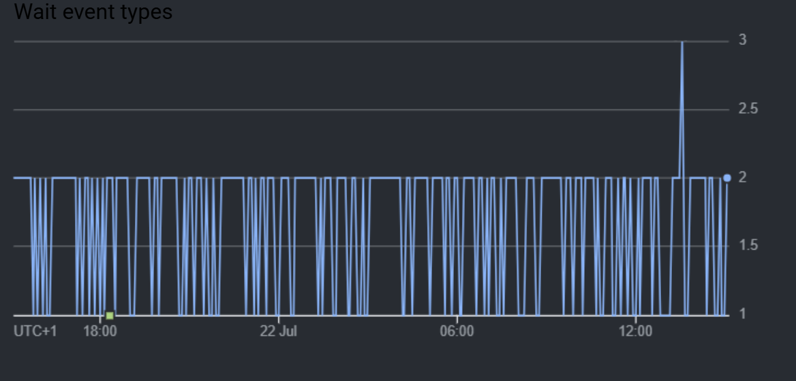
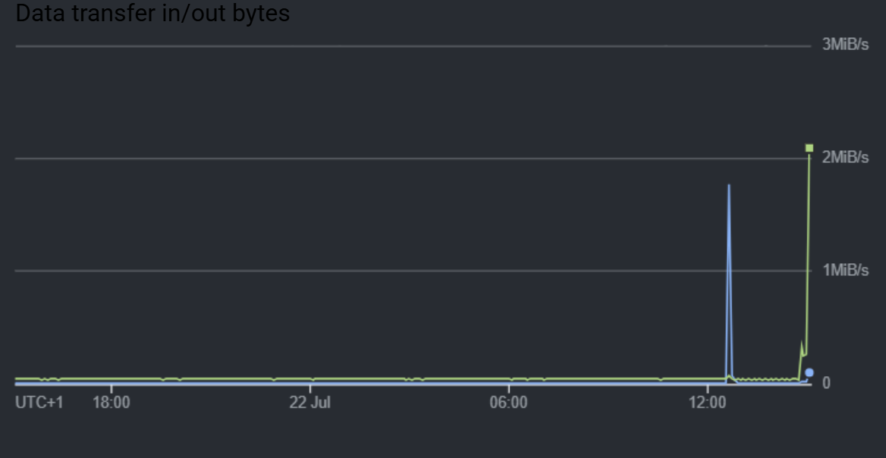

# Performance Testing: Load & Latency (TABL-604)

**Owner:** chukwuemekanwoke-jpg | **Frequency:** Before final demo/submission; re-run after any change to `api-gateway`, `ml-service`, or Cloud Run/Cloud SQL sizing
**Last Updated:** 2026-07-22 | **Last Run:** 2026-07-22 — passed, see [Results Log](#results-log)

## Status against the ticket

TABL-604 asks for load & latency testing of the application. As of 2026-07-22: the plan and script below were run once against staging (0→30 VUs, ~2.5 min), passed all thresholds with zero errors — see [Results Log](#results-log). This covers the diner journey's read paths (`nearby`/`eta`/`revpash`); booking creation and higher-concurrency stress beyond 30 VUs are not yet covered and would be natural follow-ups, not blockers for closing this ticket.

## Goals / SLOs

Without a number, "performance testing" has no pass/fail criteria. Target thresholds for a first pass:

| Metric | Target | Rationale |
|---|---|---|
| p95 latency, read endpoints (`/restaurants/nearby`, `/restaurants/:id`, `/restaurants/:id/revpash`) | < 500ms | Simple indexed queries, no external calls |
| p95 latency, `/restaurants/:id/eta` | < `config.etaTimeoutMs` (3000ms) + buffer | This route calls the Google Routes API or falls back to a haversine estimate on timeout — its own budget is already defined in code |
| Error rate under target load | < 1% (excluding intentional 429s — see [Rate Limiting](#rate-limiting-changes-what-this-test-can-do)) | |
| Concurrent users supported | 20–50 without SLO breach | Realistic ceiling for a student-project MVP demo, not a production estimate |

## Scope — end-to-end journeys, not isolated endpoints

"End to end" means simulating real user sessions (auth once, then act), not hammering one route in isolation.

**Diner journey:**
1. `POST /api/v1/auth/login` (once per virtual user, token reused after)
2. `GET /api/v1/restaurants/nearby?lat=&lng=&radiusM=`
3. `GET /api/v1/restaurants/:restaurantId/eta?lat=&lng=&mode=`
4. `POST /api/v1/bookings` (rate-limited — see below)

**Merchant journey:**
1. `POST /api/v1/auth/login` (once per virtual user)
2. `GET /api/v1/restaurants/:restaurantId` (dashboard load)
3. `GET /api/v1/restaurants/:restaurantId/revpash?window=`

Both journeys deliberately log in once and reuse the JWT for the rest of the session, matching real usage — and matching a hard constraint below.

## Rate limiting changes what this test can do

`feature/rate-limiting` (PR #76) is merged to `integrate` but **not yet on `develop`** — the currently-deployed staging site does not enforce it yet. It will as soon as `integrate` is next promoted, so this test plan accounts for it now rather than being surprised later:

- `authRateLimiter` on all `/auth/*` routes: **20 requests / 15 min per IP** (`RATE_LIMIT_AUTH_MAX`)
- `writeRateLimiter` on `POST /bookings` and `POST /campaigns`: **60 requests / 15 min per IP** (`RATE_LIMIT_WRITE_MAX`)
- Read endpoints (`nearby`, `eta`, `revpash`, restaurant detail) are **not** rate-limited.

A k6 run from one machine is one IP. Consequences:
- **Never loop the login step per iteration** — log in once per virtual user (script below already does this), or you'll hit 429s at VU #21 regardless of anything else.
- **Booking creation must stay under 60/15min per IP across all VUs combined**, not per VU — with real concurrency this ceiling arrives fast. Either keep booking-creation VUs low and accept some scripted 429s as an expected code path, or bump `RATE_LIMIT_WRITE_MAX` via a Cloud Run env var override for the duration of the test window and revert it after (do not leave it raised in staging/prod).

## Tooling

**k6** (Grafana) — script in JavaScript, supports multi-step scripted flows with variables carried between requests (needed to reuse the JWT), and encodes pass/fail thresholds directly so it can later become a CI job. No server component to install; a single binary.

Install: `choco install k6` (Windows/Chocolatey) or download from https://k6.io/docs/get-started/installation/ — this machine doesn't have it yet, verify with `k6 version` before running.

## The script

Save as `perf-test.js` (not committed to the repo — it targets a live staging URL and should stay a local/CI artifact, similar to how `.env` is gitignored):

```javascript
import http from "k6/http";
import { check, sleep } from "k6";

const BASE_URL = __ENV.BASE_URL || "https://tabl-app-staging-api.a.run.app/api/v1";
const TEST_EMAIL = __ENV.TEST_EMAIL;
const TEST_PASSWORD = __ENV.TEST_PASSWORD;
const RESTAURANT_ID = __ENV.RESTAURANT_ID;

// Times below are placeholders — swap for a real Manhattan lat/lng pair.
const USER_LAT = 40.758;
const USER_LNG = -73.9855;

export const options = {
  scenarios: {
    diner_journey: {
      executor: "ramping-vus",
      startVUs: 0,
      stages: [
        { duration: "30s", target: 10 }, // ramp up
        { duration: "1m", target: 10 },  // hold — load test
        { duration: "30s", target: 30 }, // push further — stress
        { duration: "30s", target: 0 },  // ramp down
      ],
    },
  },
  thresholds: {
    "http_req_duration{route:nearby}": ["p(95)<500"],
    "http_req_duration{route:eta}": ["p(95)<3500"],
    "http_req_duration{route:revpash}": ["p(95)<500"],
    http_req_failed: ["rate<0.01"],
  },
};

export function setup() {
  if (!TEST_EMAIL || !TEST_PASSWORD || !RESTAURANT_ID) {
    throw new Error(
      "Set BASE_URL, TEST_EMAIL, TEST_PASSWORD, RESTAURANT_ID env vars before running. " +
      "Use a dedicated staging test account, never a real one."
    );
  }
  const loginRes = http.post(
    `${BASE_URL}/auth/login`,
    JSON.stringify({ email: TEST_EMAIL, password: TEST_PASSWORD }),
    { headers: { "Content-Type": "application/json" }, tags: { route: "login" } }
  );
  check(loginRes, { "login succeeded": (r) => r.status === 200 });
  return { token: loginRes.json("token") };
}

export default function (data) {
  const authHeaders = { headers: { Authorization: `Bearer ${data.token}` } };

  const nearbyRes = http.get(
    `${BASE_URL}/restaurants/nearby?lat=${USER_LAT}&lng=${USER_LNG}&radiusM=3000`,
    { ...authHeaders, tags: { route: "nearby" } }
  );
  check(nearbyRes, { "nearby 200": (r) => r.status === 200 });

  const etaRes = http.get(
    `${BASE_URL}/restaurants/${RESTAURANT_ID}/eta?lat=${USER_LAT}&lng=${USER_LNG}&mode=walking`,
    { ...authHeaders, tags: { route: "eta" } }
  );
  check(etaRes, { "eta 200": (r) => r.status === 200 });

  const revpashRes = http.get(
    `${BASE_URL}/restaurants/${RESTAURANT_ID}/revpash?window=7d`,
    { ...authHeaders, tags: { route: "revpash" } }
  );
  check(revpashRes, { "revpash 200 or 403 (non-manager)": (r) => [200, 403].includes(r.status) });

  sleep(1); // think-time between iterations, avoids an unrealistic tight loop
}
```

Notes on the script:
- Booking creation (`POST /bookings`) is deliberately **not** included in the main loop given the 60/15min write-rate ceiling — run it as a separate, small, dedicated scenario if you need booking-path numbers, with VUs low enough to stay under that ceiling for the whole run.
- `RESTAURANT_ID` must be a real UUID from the staging database — pull one via `GET /restaurants/nearby` manually first, or query the DB directly.
- The `revpash` check accepts both 200 and 403 because that route requires the caller to be the restaurant's manager (`requireRestaurantManager`) — if your test account isn't a manager of `RESTAURANT_ID`, a clean 403 is correct behavior, not a failure.

## How to Run

1. **Create a dedicated staging test account** — do not reuse a real teammate's login. Register one via the app or `POST /auth/register` directly.
2. **Confirm k6 is installed:** `k6 version`
3. **Set the required env vars and run:**
   ```
   $env:BASE_URL="https://<your-staging-api-url>/api/v1"
   $env:TEST_EMAIL="perf-test@example.com"
   $env:TEST_PASSWORD="<the account's password>"
   $env:RESTAURANT_ID="<a real restaurant UUID from staging>"
   k6 run perf-test.js
   ```
4. **Watch Cloud Monitoring while it runs** (Cloud Run → `api-gateway` → Metrics): request latency, instance count (autoscaling behavior under the ramp), and container CPU/memory. Separately watch Cloud SQL (`tabl-db-staging`) active connections — `pool.js`'s max pool size could exhaust under concurrent load before the app itself does.
5. **Read k6's summary output** at the end of the run: check `http_req_duration` percentiles per route (tagged `nearby`/`eta`/`revpash`) against the thresholds above, and `http_req_failed` rate. k6 exits non-zero if any threshold fails — useful once this becomes a CI job.
6. **Record the result** in the [Results Log](#results-log) below, and update TABL-604's status in Jira accordingly.

## Results Log

*(Append one entry per run — date, k6 summary highlights, any threshold failures, any follow-up actions.)*

- **2026-07-22 — first run, passed.** Ran against live staging (`https://api-gateway-pkzkrctrya-ew.a.run.app`), 0→30 VUs over ~2.5 min (30s ramp, 1m hold at 10, 30s push to 30, 30s ramp down), 1,583 completed diner journeys, ~31.5 req/s peak.

  | Route | p95 | Threshold |
  |---|---|---|
  | `nearby` | 82.7ms | < 500ms ✓ |
  | `eta` | 39.2ms | < 3500ms ✓ |
  | `revpash` | 55.4ms | < 500ms ✓ |
  | Error rate | 0.00% | < 1% ✓ |

  All thresholds passed, zero failed requests. Staging shows no sign of strain at 30 concurrent VUs — this run doesn't find a ceiling, just confirms the app is well within target at this load.

  **First attempt failed on a script bug, not a system bug**: assumed `/revpash` returns 403 for a non-manager (actual code returns 401 — see `requireRestaurantManager.js`) and used an invalid `window=7d` (valid values are `today`/`week`/`month`). Fixed by registering a dedicated test restaurant (`Perf Test Restaurant`, `6428f03c-af44-4314-8a70-1032f03a0500`) owned by the test account (`perf-test-2026-07-22@example.com`) so `revpash` exercises its real success path. Both the test account and restaurant are left in place in staging (harmless, reusable for the next run).

  **Follow-ups, not blockers**: booking creation (`POST /bookings`) wasn't load-tested (write-rate-limiter ceiling on `integrate`, not yet on `develop`); no stress test was run beyond 30 VUs to find an actual breaking point.

- **2026-07-22 — second run, 100 VUs (the ticket's stated target), bottleneck found.** Reopened TABL-604 after confirming the full ticket asks for 100 concurrent users, not 30. Re-ran with stages ramping 0→25→100 over 4 minutes, tightened the `nearby`/`revpash` thresholds to the ticket's actual `<200ms` target. 9,860 completed diner journeys, ~122.6 req/s peak, **zero failed requests** — but two routes missed the latency target:

  | Route | p95 @ 30 VUs | p95 @ 100 VUs | Target | Result |
  |---|---|---|---|---|
  | `nearby` | 82.7ms | 364.0ms | <200ms | ✗ Fails |
  | `revpash` | 55.4ms | 227.5ms | <200ms | ✗ Fails |
  | `eta` | 39.2ms | 293.1ms | <3500ms | ✓ (7.5× worse, but within its own bar) |
  | Error rate | 0.00% | 0.00% | <1% | ✓ |

  **Root cause, confirmed against Cloud SQL Insights for the test window (13:59–14:03 UTC):**

  

  CPU utilisation peaked at only ~20% during the 100-VU run — nowhere near saturated. Compute was not the constraint.

  

  Connections per database spiked to ~19 at exactly the moment of the 100-VU run (flat at 1–2 for the rest of the graph). `backend/api-gateway/src/db/pool.js` creates `new Pool({ connectionString: config.databaseUrl })` with **no `max` set** — node-postgres defaults to 10 connections per pool. Cloud Run's `api-gateway` config (`containerConcurrency: 80`, `maxScale: 20`) has far more headroom than this load needed, so it almost certainly never scaled past a single instance — meaning that single instance's 10-connection default pool is the actual ceiling, not Cloud Run itself.

  

  Wait events, which oscillate between 1–2 throughout the whole graph, spike to 3 at the same moment — consistent with queries queueing for a free connection rather than the database itself struggling.

  

  Data transfer confirms the timing (a clear spike right at the run), unremarkable in volume — this rules out network throughput as a factor.

  **Conclusion**: the bottleneck is the unconfigured default connection pool size in `pool.js`, not Cloud Run capacity, CPU, or network. The app degrades gracefully under this (zero errors), but misses the ticket's `<200ms` target at 100 concurrent users purely on pool contention.

  **Decision (2026-07-22): left as-is for now** — documenting the finding and root cause is sufficient for this pass. Fixing it (setting an explicit `max` on the `Pool` in `pool.js`, e.g. 20–30) is a follow-up code change, not a testing-doc change, and would need its own verification pass once made.

## Open Questions / Risks

- **`/eta` cost under load:** this route calls the real Google Routes API when not cached. Repeated load-test iterations against the same restaurant/coordinates will mostly hit the in-process ETA cache (`getCachedEta`/`setCachedEta`), which is good for cost but means this test may not accurately measure the *uncached* Google Routes API latency path. If that path specifically needs testing, vary `lat`/`lng` slightly per iteration to force cache misses — but that increases real API spend, so keep iteration counts low if doing so.
- **Rate limiting is not yet on staging** (see above) — this plan is written against `integrate`'s state so it doesn't need rework the moment that lands on `develop`. Re-verify the limiter numbers in `config.js` haven't changed by the time this actually runs.
- **CI integration is out of scope for this first pass** — once a manual run produces trustworthy numbers, promoting this into a `.github/workflows/ci.yml` job (smoke-level, on a schedule or manual trigger against staging) is the natural next step, not part of TABL-604 itself.
- **Firebase Performance Monitoring — considered, deferred, not a substitute for the above.** It's Real User Monitoring: it instruments the client app (web/mobile) and reports on real traffic that already happened, but it can't generate load and can't observe k6's traffic at all (k6 hits `api-gateway` directly, never through the instrumented client). Worth adding later as a separate "how does this feel to real users" check once the app has real traffic — neither the web app nor the mobile app currently has the Firebase SDK installed (the project's only current Firebase usage is static Hosting for the web build). Not part of TABL-604.
