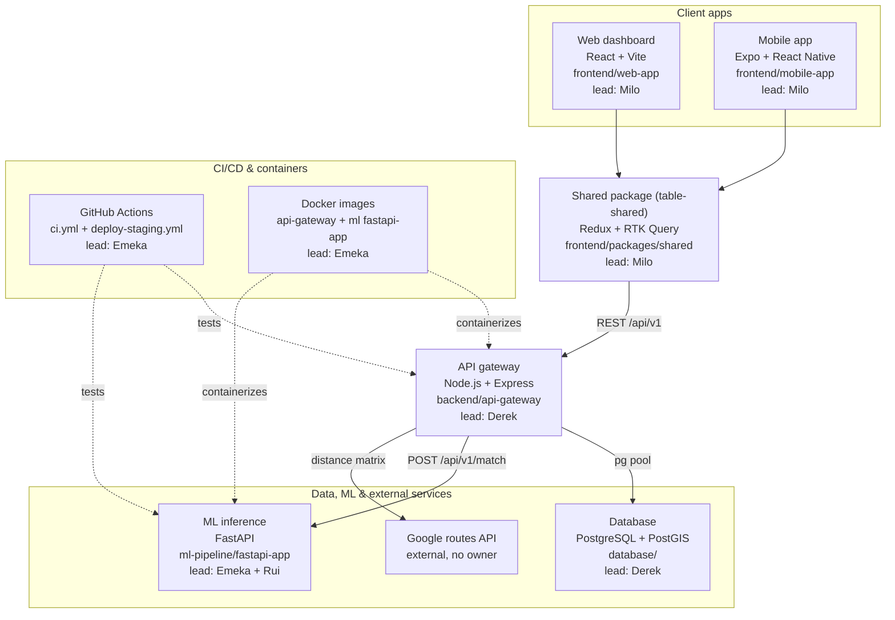
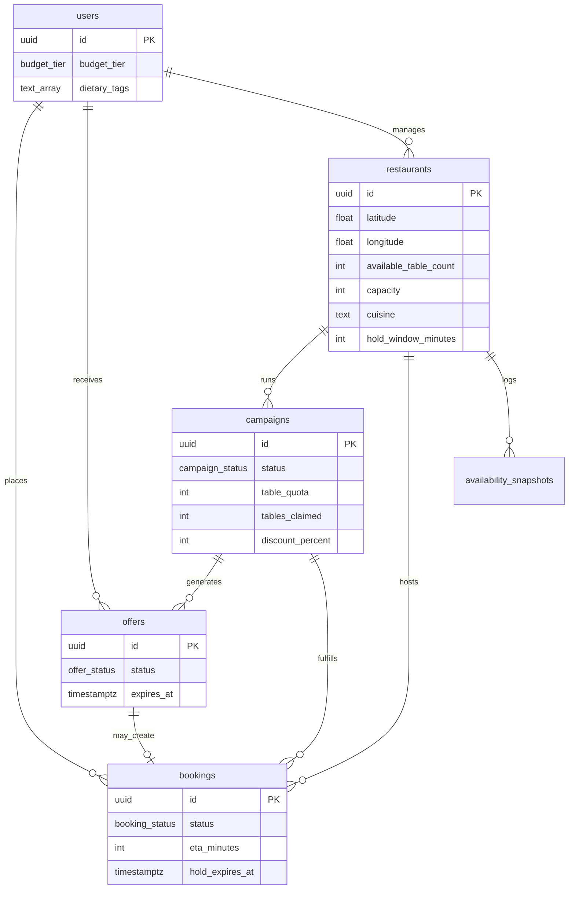

# System architecture map (integrate branch)

Snapshot of every file on `integrate`, grouped by domain, tagged with its lead
(by commit history) and how it depends on the rest of the system.

## Request flow

## Backend — `backend/api-gateway/` (lead: **Derek**, 15 commits; secondary: Emeka)

Node.js/Express REST API — the hub everything else calls.

| File | Role |
|---|---|
| `src/index.js` | boots the app, calls `db/pool.js` to check connectivity |
| `src/app.js` | wires middleware + `routes/apiV1` |
| `src/config.js` | reads `.env` — `DATABASE_URL`, `ML_SERVICE_URL`, `GOOGLE_MAPS_API_KEY` |
| `src/db/pool.js` | Postgres connection pool → depends on **database/** schema |
| `src/routes/apiV1/{bookings,campaigns,offers,restaurants,restaurantBookings,users,index}.js` | REST endpoints, each delegates to a matching `services/` file |
| `src/routes/health.js`, `src/routes/merchantRoutes.js` | health check, merchant-only routes |
| `src/services/createBooking.js`, `createCampaignOffers.js`, `offerInsert.js`, `offers.js`, `candidateUsers.js` | business logic, query `db/pool.js` |
| `src/services/mlMatchClient.js` | calls **ML inference** (`POST {ML_SERVICE_URL}/api/v1/match`) |
| `src/services/googleDistanceMatrix.js`, `etaResolver.js` | call **Google Routes API** (external), fall back to `utils/geo.js` haversine |
| `src/middleware/{asyncHandler,errorHandler,notFound,requireUser,requireRestaurantManager}.js` | cross-cutting request handling |
| `src/utils/{etaCache,geo,serialize,validate}.js` | shared helpers |
| `src/__tests__/*.test.js` (7 files) | Jest suite, run by `.github/workflows/ci.yml` |
| `scripts/check-openapi-drift.js` | diffs routes against `docs/openapi-v0.yaml` |
| `Dockerfile`, `.dockerignore`, `package-lock.json` | Cloud Run prep |
| `.env.example`, `README.md`, `package.json` | config/docs |

## Database — `database/` (lead: **Derek**, 8 commits)

| File | Role |
|---|---|
| `migrations/001*`, `002_postgis_optional.sql`, `003*` (+ `.down.sql`) | schema, consumed by `pool.js` queries |
| `seeds/001_demo_manhattan.sql`, `002_manhattan_real.sql` | seed data |
| `scripts/{migrate,seed,generate-seed}.js` | migration/seed runners |
| `docker-compose.yml` | local Postgres+PostGIS container |
| `schema.md`, `README.md`, `.env.example` | docs/config |

### Database schema

Source: `migrations/001_initial_schema.sql` (+ `002_postgis_optional.sql`,
`003_add_restaurant_capacity_cuisine.sql`) and `schema.md`.

**`users`** — consumer profiles. `id` (UUID PK), `display_name`, `budget_tier`
(enum `TIER_1`/`TIER_2`/`TIER_3` → €/€€/€€€), `dietary_tags` (`TEXT[]`, ML
feature), `last_lat`/`last_lng`. Auth is JWT-based; seed data can use a fixed
UUID via an interim `X-User-Id` header.

**`restaurants`** — Manhattan venue master data. `id` (UUID PK), `name`,
`latitude`/`longitude` (validated -90..90 / -180..180), `neighborhood`,
`address_line`. `available_table_count` (denormalized "live" count, must be
`<= capacity`), `capacity` (migration 003), `cuisine` (slug, migration 003).
`hold_window_minutes` (default 15), `busyness_score` (0–1, ML-fed),
`is_wheelchair_accessible`, `sensory_friendly`. `manager_user_id` → FK to
`users` (links a merchant dashboard user to their venue, `ON DELETE SET
NULL`). Indexes: partial index on `available_table_count > 0`, index on
`neighborhood`. Migration 002 (optional) adds a PostGIS `GEOGRAPHY(POINT,
4326)` column + GIST index for `ST_DWithin` radius queries — not applied by
default; v1 uses plain lat/lng with haversine done in app/SQL (1500m
discovery radius).

**`campaigns`** — restaurant-triggered flash-deal runs. `id` (UUID PK),
`restaurant_id` FK (`ON DELETE CASCADE`), `status` (enum
`active`/`completed`/`cancelled`). `table_quota`, `tables_claimed` (CHECK
`tables_claimed <= table_quota`), `discount_percent` (CHECK 10–50). Partial
index on `restaurant_id` where `status = 'active'`.

**`offers`** — per-user flash-deal inbox items. `id` (UUID PK), `campaign_id`
FK, `user_id` FK (both cascade), `status` (enum
`pending`/`accepted`/`expired`/`revoked`). `expires_at` (app sets `created_at
+ 900s`), unique constraint on `(campaign_id, user_id)` — one offer per user
per campaign. Indexes: `(user_id, status, expires_at)` for inbox reads,
partial index on pending offers per campaign.

**`bookings`** — reservations, standalone or deal-backed. `id` (UUID PK),
`user_id`/`restaurant_id` FK (cascade), `offer_id`/`campaign_id` FK
(nullable, `SET NULL`). `status` (enum
`pending`/`confirmed`/`cancelled`/`completed`/`no_show`), `transport_mode`
(enum `walking`/`driving`/`transit`/`cycling`). `eta_minutes`,
`hold_expires_at`. CHECK: `offer_id` and `campaign_id` must both be null or
both set (no orphaned half-deal bookings).

**`availability_snapshots`** — append-only busyness history. `id`
(BIGSERIAL PK), `restaurant_id` FK (cascade), `recorded_at`,
`available_table_count`, `busyness_score`. Feeds the ML pipeline's
time-series training data.

**`schema_migrations`** — simple version tracker (`version`, `applied_at`).

**DB-enforced behavior** (not just app code):
- `set_updated_at()` trigger on `users`/`restaurants` — auto-stamps `updated_at`
- `sync_campaign_after_booking_confirm()` trigger on `bookings` (Story 5.2) —
  when a booking tied to a campaign is confirmed: increments
  `campaigns.tables_claimed`; if claimed reaches quota, flips the campaign to
  `completed` and bulk-revokes any still-pending `offers` for that campaign
- Value constraints as CHECKs, not app code: `discount_percent BETWEEN 10 AND
  50`, `available_table_count <= capacity`, non-negative counts/ETAs, valid
  lat/lng ranges

This backs `backend/api-gateway`'s services directly — `createBooking.js` /
`createCampaignOffers.js` insert into `bookings`/`offers`, and
`mlMatchClient.js`'s output (from `ml-pipeline`) becomes the `user_id` list
that `createCampaignOffers.js` turns into `offers` rows.

## ML pipeline — `ml-pipeline/` (lead: **Emeka**, 4 commits; **Rui**, recommendation algorithm, 3 commits)

| File | Role |
|---|---|
| `fastapi-app/main.py` | serves `/api/v1/match` (called by `mlMatchClient.js`) and `/predict/busyness` |
| `fastapi-app/requirements.txt`, `test_main.py`, `README.md` | deps/tests/docs |
| `fastapi-app/Dockerfile`, `.dockerignore` | Cloud Run prep |
| `notebooks/*.ipynb` (`data_engineering_v1/v2`, `model training and evaluation`, `recommendation`) | offline model development — informs the heuristics in `main.py`, not imported at runtime |
| `notebooks/*.csv`, `*.xlsx`, `taxi_zones.zip` | training/reference datasets used by the notebooks above |

## Frontend shared — `frontend/packages/shared/` (lead: **Milo**, 7 commits)

| File | Role |
|---|---|
| `src/apiSlice.ts` | RTK Query client → calls **API gateway** `/api/v1/*` |
| `src/authSlice.ts`, `userSlice.ts` | Redux slices, consumed by both apps |
| `src/store.ts`, `hooks.ts`, `types.ts`, `index.ts` | store setup, typed hooks, shared types |

Imported via **relative path** (`../../packages/shared/src/...`) by both `web-app`
and `mobile-app` — not a declared npm dependency, just a monorepo path import.

## Frontend web — `frontend/web-app/` (lead: **Milo**, 8 commits; secondary: Andrew)

| File | Role |
|---|---|
| `src/main.jsx`, `app.jsx`, `store.js` | entry point, wires `table-shared`'s `apiSlice` |
| `src/context/AuthContext.jsx` | auth state, backed by `authSlice` |
| `src/views/{LoginView,RegisterView,ProfileSetupView,ExploreView,MerchantDashboard,FlashDealBookingView}.jsx` | route-level screens |
| `src/components/*` (17 files: `MapComponent`, `TableGrid`, `MerchantRadar`, `OccupancyMeter`, etc.) | dashboard UI |
| `src/services/{MapService,MerchantService,OnboardingService}.js` | talk to shared `apiSlice` / browser APIs |
| `src/hooks/useMerchantSocket.js` | live merchant updates |
| `src/components/__tests__/*`, `views/__tests__/*`, `test/setup.js` | Vitest suite |
| `vite.config.js`, `tailwind.config.js`, `.eslintrc.cjs`, `index.html`, `index.css` | build/config |

## Frontend mobile — `frontend/mobile-app/` (lead: **Milo**, 13 commits)

| File | Role |
|---|---|
| `src/app/_layout.tsx`, `index.tsx`, `tabs/*` | Expo Router screens/tabs |
| `src/components/*` (9 files: `BookingCard`, `OfferCard`, `RestaurantCard`, `WebMap`, etc.) | UI components |
| `src/context/{ProfileContext,UserContext}.tsx` | local state, layered on top of `table-shared` |
| `src/services/pushNotifications.ts` | Expo push notifications (see `push-notifications.md`) |
| `metro.config.js`, `babel.config.js`, `tailwind.config.js`, `app.json`, `eas.json` | build/config |
| `assets/**` (icons, splash, tab icons) | static assets, no dependencies |

## CI/CD & docs (lead: **Emeka**, plus **Derek** on docs)

| File | Role |
|---|---|
| `.github/workflows/ci.yml` | lints/tests all 4 workspaces + `check-openapi-drift.js` |
| `.github/workflows/deploy-staging.yml` | placeholder deploy job — next GCP task replaces this with real `gcloud run deploy`, targeting the two Dockerfiles above |
| `docs/openapi-v0.yaml` | contract source of truth for `api-gateway` + `table-shared` |
| `docs/adr/ADR-001.md`, `api-contract-v0.md`, `deployment-guide.md`, `integration-strategy.md`, `data-strategy.md`, `frontend-strategy.md`, `product-spec.md`, `ui-style-guide.md`, `user-stories/*` | planning/reference docs, no runtime dependency |
| root `package.json` | npm workspaces list tying the 4 packages together; `redocly.yaml` lints the OpenAPI spec |
