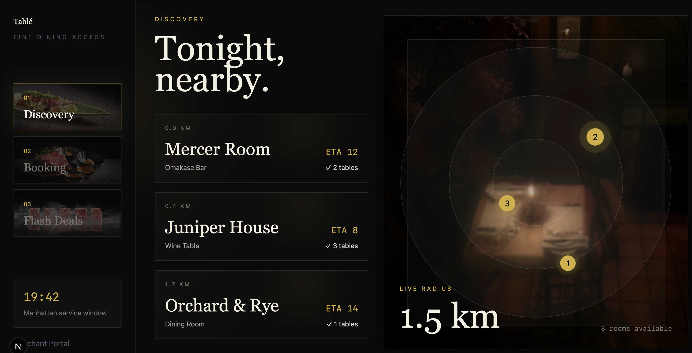
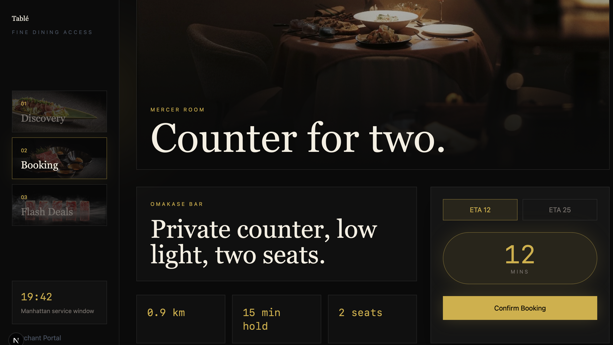
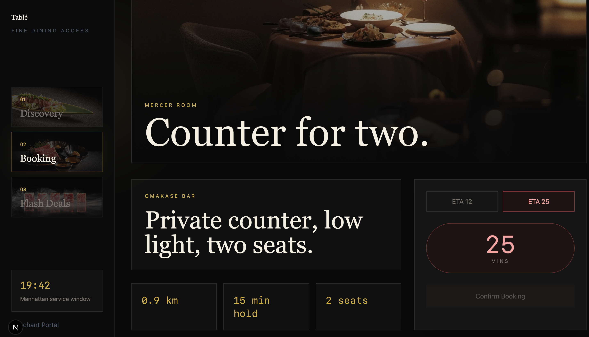
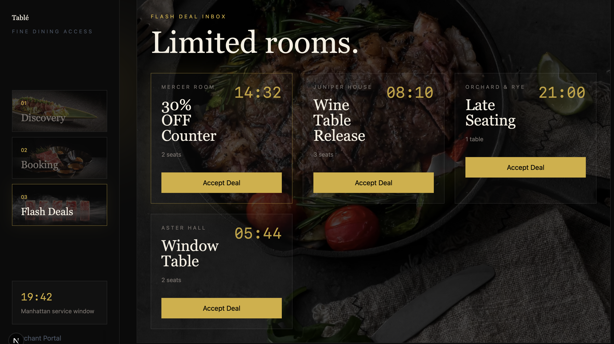

# Tablé C-side Web App Frontend Summary
This is the current shared frontend prototype for the Sprint 1 Product & UX work and the personal full-stack build foundation. The UI has been refactored into a desktop-first fine-dining dark mode web app.

## 1. Tech Stack
This prototype uses **Next.js + React + TypeScript**, with **Tailwind CSS** for styling and **Framer Motion** for page transitions, hover states, glow effects and the Flash Deal expansion animation. It is a desktop-first customer-side prototype for Sprint 1, focused on the core dining flow: discover an available table, validate ETA, confirm a booking and accept a flash deal.

Run locally:
```bash
cd .../table-customer-web-app  
npm install  
npm run dev
```
Open `http://127.0.0.1:3000`.

## 2. Scope
Implemented as one cohesive web app prototype:
- **Discovery**: split-screen restaurant list and atmospheric dark radar map with linked glowing pins.
- **Booking**: cinematic wide hero plus glass ETA validation card.
- **Flash Deals**: desktop grid with tabular countdowns and animated QR redemption expansion.

## 3. Frontend Flow

The app is organized around a fixed left sidebar and one main content area. The user can switch between **Discovery**, **Booking** and **Flash Deals** without leaving the page. The current prototype uses local mock data in `app/data.ts`; these objects are shaped so they can later be replaced by backend API responses.

Key files:
- `app/page.tsx`: page composition and interactive UI components.
- `app/data.ts`: mock restaurants, flash deals and image asset paths.
- `app/types.ts`: shared TypeScript types for frontend-backend alignment.
- `app/globals.css`: Tailwind entry and global visual foundation.
- `public/images/`: named visual assets used by the interface.
  

## 4. Wireframe Descriptions

### Discovery
Screenshots: 
- 

Source: `02-discovery.md`

Requirement:
- Show restaurants strictly within `1.5 km`.
  
- Only display restaurants with `available_table_count > 0`.
  
- If GPS is denied, show `Location required` and allow manual neighbourhood input.

Prototype response:
- Discovery module shows available restaurants within `1.5 km`.
  
- Restaurant cards include distance, ETA, table count, busyness and accessibility tags.
  
- Map pins show available table counts.
  
- State controls demonstrate results, loading, GPS denied and empty states.
  

### Booking
Screenshots:
- 
- 

Source: `03-booking.md`

Requirement:
- Restaurant has a `15-minute` hold window.
  
- If ETA is `12 minutes`, booking is enabled and green/success copy is shown.
  
- If ETA is `25 minutes`, booking is disabled and warning copy is shown.
  

Prototype response:
- Booking module has a selected restaurant page.
  
- ETA state can be toggled between `12 min` and `25 min`.
  
- Confirm Booking is enabled only for valid ETA.
  
- Invalid state displays: `You are too far to guarantee this table.`

### Flash Deal
Screenshots:

- 

Source: `04-offers.md`

Requirement:
- Flash Deal has a `900-second` TTL.
  
- When countdown reaches `00:00`, Accept Deal becomes disabled and text changes to `Offer Expired`.
  
- Accepted deal may later be cancelled and QR removed.
  

Prototype response:
- Offers module shows active, accepted and expired states.
  
- Active state displays a visible countdown.
  
- Expired state disables the accept button.
  
- Accepted state displays QR redemption and a `Cancel Booking` action.

## 5. Backend Handoff
Mock data lives in `app/data.ts`; shared types live in `app/types.ts`. When the backend is ready, replace the arrays in `app/data.ts` with API responses for restaurants, ETA validation and flash deals.